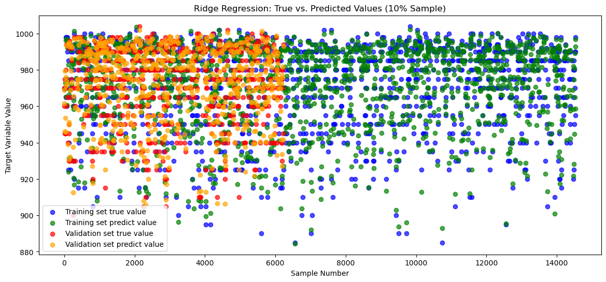
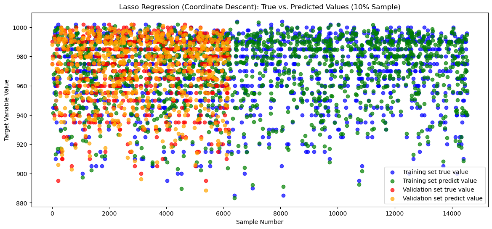
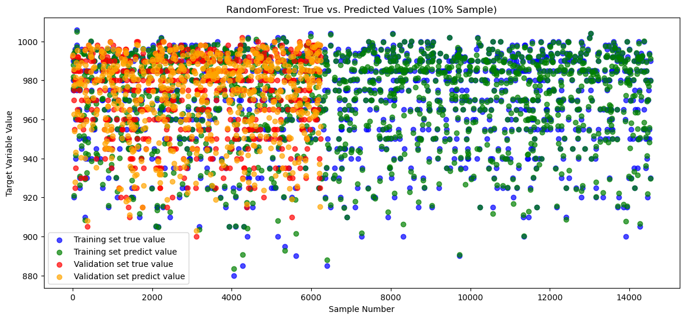

# 实验报告
## 一、课题综述

### 1.1 课题说明

本课题研究的对象是台风的历史数据和实时监测数据，旨在通过机器学习中的回归方法对台风的关键指标（如风速、气压、路径等）进行建模和预测，从而提高对台风强度和路径的理解与预测能力。

台风作为一种破坏性极强的自然灾害，准确预测其强度和路径对防灾减灾、社会经济发展和公共安全都具有重大意义。然而，台风运动具有高度的复杂性和随机性，传统的气象预测方法在面对大量复杂特征时往往难以提供精确的预测结果。因此，本课题利用机器学习中的多种回归技术，探索通过以下几种回归模型来预测台风的关键参数：

1. **线性回归（Linear Regression）**：该模型用于探索台风数据中各特征变量与目标变量（如风速、气压等）之间的线性关系。其优点在于简单易于理解，适用于数据线性关系较强的情况。
   
2. **Lasso 回归（Lasso Regression）**：通过引入 L1 正则化项，该模型可以有效进行特征选择，减少模型的复杂度和过拟合现象，适合处理具有稀疏性的高维数据。

3. **Ridge 回归（Ridge Regression）**：利用 L2 正则化项，该模型可以有效缓解多重共线性问题，减少对噪声的敏感性，适合数据中存在高度相关特征的情况。

4. **随机森林回归（Random Forest Regression）**：通过构建多棵决策树并对结果进行投票，随机森林可以有效处理非线性关系并提供较高的鲁棒性，适用于数据噪声较大且特征较为复杂的情况。

5. **GBDT 回归（Gradient Boosting Decision Tree Regression）**：该模型通过集成学习逐步修正预测误差，适用于处理具有非线性关系的复杂预测问题，且在处理小规模高维数据时表现出色。

6. **神经网络回归（Neural Network Regression）**：通过多层神经网络对数据进行非线性回归，能够捕获复杂的非线性关系，适合处理具有高度非线性的时序数据。

小组的分工为：

综上，本课题通过不同的回归模型对台风的关键特征进行建模和预测，尝试探索机器学习在台风预测领域的应用，为更精准的台风预报提供技术支持。

### 1.2 课题目标

针对本课题，我们小组的目标如下：

1. **模型构建与实现**  
   手写实现线性回归、Lasso 回归、 Ridge 回归、随机森林回归、GBDT 回归和神经网络回归等回归模型，深入理解损失函数、梯度下降及正则化机制，并通过代码实现各个模型的核心算法。

2. **模型性能分析与优化**  
   - 探讨**学习率**对模型收敛速度和稳定性的影响，确定最优学习率。  
   - 研究**正则化参数**（L1 和 L2）对权重分布及过拟合控制的影响，并优化这些参数以提升模型性能。

3. **特征工程与数据分析**  
   - 通过相关矩阵等工具分析输入变量的相关性，筛选对预测效果影响较大的特征。  
   - 尝试采用降维方法（PCA），探索提升模型效果的有效方法。

4. **模型训练与评估**  
   利用训练集和测试集训练回归模型，使用均方误差（MSE）、平均绝对误差（MAE）、平均绝对百分比误差（MAPE）以及决定系数（R²）对模型进行评估。

5. **结果可视化与解释**  
   可视化模型预测结果与实际值的对比，分析特征对预测结果的贡献，解释模型的内在预测机制。

6. **总结与展望**  
   总结各回归模型的优缺点，分析其在台风预测中的表现，为未来深度学习和集成学习模型的研究提供参考。

### 1.3 课题数据集

本课题使用的数据集来源于 Kaggle 上的[台风数据集](https://www.kaggle.com/code/skyil7/simple-forecast-of-typhoon-using-ml#Forecasting-Typhoons-by-Machine-Learning)，该数据集包含台风的历史观测记录及相关气象特征。主要数据包括每个台风在不同时间点的风速、气压、经纬度等指标，以及台风的总体信息如编号、名称和最大风速等。

数据集经过预处理后，我们重点关注台风的核心气象特征，进行模型的训练和预测任务。为确保数据质量，数据预处理包括缺失值填补、数据合并和时间序列转换等步骤。最终，数据集划分为训练集和测试集，分别用于模型的构建和评估。

该数据集的优势在于提供了丰富的气象特征和时间序列信息，能够支持多种机器学习模型的训练；但挑战在于台风特征的复杂性及数据不平衡问题，这要求我们在特征提取和模型设计上做出精细的调整以提高预测精度。


## 二、实验报告设计

### 2.1 数据准备

本实验使用的数据集来源于 Kaggle 上的台风历史数据集。该数据集记录了台风在不同时刻的详细气象观测数据，包含了多个重要的气象特征，如台风中心的经纬度、气压、风速等。通过这些数据，实验旨在利用机器学习模型对台风的强度和路径进行回归预测。

#### 数据集描述

数据集主要包括以下两部分：

1. **`typhoon_data.csv`**：记录了台风在不同时间点的气象特征，具体包括：
   - **Year**、**Month**、**Day**、**Hour**：记录观测时的日期和时间，标明台风在不同时间点的状态。
   - **Latitude of the center** 和 **Longitude of the center**：台风中心的经纬度。
   - **Pressure**：台风中心的气压，这也是本实验的预测目标。
   - **Wind Speed**：台风中心的风速。

2. **`typhoon_info.csv`**：提供了台风事件的总体信息，包括台风编号、台风名称、台风的生命周期（起始和结束时间）、最大风速、最低气压等。

### 2.2 数据预处理

在本实验中，数据预处理是确保模型能够有效训练的关键步骤。针对台风数据的多维特征和数据完整性，我们采取了多个数据清理和特征处理的步骤。根据代码内容，具体的预处理过程如下：

#### 1. 数据加载

在数据预处理的第一步，使用 Pandas 读取了 `typhoon_data.csv` 文件，加载数据并进行初步检查。通过 `head()` 和 `info()` 方法，我们能够查看数据的基本结构、各个特征的类型以及是否存在缺失值。

```python
data = pd.read_csv('../data/typhoon_data.csv', index_col=0)
data.head()  # 查看数据前几行
```

#### 2. 特征缩放

由于不同特征的取值范围存在较大差异（如经纬度、风速和气压的量级不同），代码对经纬度进行了缩放处理。这种缩放有助于减少特征之间的数值差异，从而避免某些特征在训练过程中对模型产生过大的影响。

```python
# 对台风中心的经纬度进行缩放处理
data["Latitude of the center"] /= 10
data["Longitude of the center"] /= 10
```

在这一步中，**经纬度**被分别除以 10，这是一种简便的缩放方式，能够保证经纬度数值范围适合模型输入。

#### 3. 删除无关特征

在本实验中，删除了一些与预测目标无关或对模型训练无帮助的特征。通过代码中的操作，可以看到 `Indicator of landfall or passage` 这一列被删除。这种操作简化了数据，避免模型学习不必要的冗余信息。

```python
# 删除不必要的特征
data = data.drop(["Indicator of landfall or passage"], axis=1)
```

这一特征与台风中心气压和路径预测无直接关联，因此在预处理阶段被剔除。

#### 4. 数据集划分

数据预处理完成后，将数据集划分为训练集和测试集。训练集用于训练模型，而测试集用于评估模型的性能。数据集划分采用 7:3 的比例，这是一种常见的划分方式，可以确保模型既能够获得充足的训练数据，又能够通过测试数据评估其泛化能力。

```python
from sklearn.model_selection import train_test_split

# 提取特征和目标变量
X = data.drop(columns=['Wind Speed'])  # 特征
y = data['Wind Speed']  # 目标变量

# 划分训练集和测试集，70% 用于训练，30% 用于测试
X_train, X_test, y_train, y_test = train_test_split(X, y, test_size=0.3, random_state=42)
```
#### 5. PCA 降维
为了进一步减少数据的维度，提高模型的效率，我们在数据集上应用了 PCA（主成分分析） 进行降维。PCA 的主要目的是将高维数据映射到较低的维度空间，保留尽可能多的原始信息，减少冗余特征的影响。

在本实验中，数据的高维特征通过 PCA 被降维至两个主成分。下图展示了通过 PCA 降维后的数据分布情况，图中颜色表示不同类别的样本，两个主成分展示了数据在降维后的表现(由于本数据集维度较低，PCA降维效果较差，这里仅给出2维视角下数据集的划分)


如图所示，PCA 有助于将数据在二维空间内可视化，不同类别的台风数据通过主成分得以区分。这种降维方式不仅能提升模型的效率，还能减少噪声对模型的影响。

### 2.3 模型搭建

在本实验中，模型搭建主要围绕几种经典的机器学习回归模型进行实现，包括线性回归、Ridge 回归、Lasso 回归、随机森林回归、梯度提升决策树（GBDT）回归以及神经网络回归。每个模型均采用手写实现，重点在于深入理解其核心算法和机制。

#### 1. 线性回归（Linear Regression）

线性回归是一种基本的回归模型，通过寻找特征与目标变量之间的线性关系来进行预测。模型的核心在于最小化均方误差（MSE）损失函数，计算目标变量和预测值之间的误差，并利用梯度下降优化模型参数。文件中的 `LinearRegression.py` 实现了该模型的核心计算。

```python
import models.LinearRegression as lr

# 实例化线性回归模型
linear_model = lr.LinearRegression()

# 训练线性回归模型
linear_model.fit(X_train, y_train)

# 预测
y_pred_lr = linear_model.predict(X_test)
```

#### 2. Ridge 回归（Ridge Regression）

Ridge 回归在线性回归的基础上加入了 L2 正则化项，以防止模型过拟合。正则化项对大权重进行惩罚，鼓励模型选择较小的参数值，从而提高模型的泛化能力。文件中的 `RidgeRegression.py` 实现了该模型。

```python
import models.RidgeRegression as rr

# 实例化 Ridge 回归模型
ridge_model = rr.RidgeRegression(alpha=1.0)

# 训练 Ridge 回归模型
ridge_model.fit(X_train, y_train)

# 预测
y_pred_rr = ridge_model.predict(X_test)
```

#### 3. Lasso 回归（Lasso Regression）

Lasso 回归与 Ridge 回归类似，但使用 L1 正则化，它的特点是可以将不重要的特征系数缩小为零，从而实现特征选择。这使得 Lasso 回归在处理高维数据时非常有用。文件中的 `LassoRegression.py` 实现了该模型。

```python
import models.LassoRegression as ls

# 实例化 Lasso 回归模型
lasso_model = ls.LassoRegression(alpha=0.1)

# 训练 Lasso 回归模型
lasso_model.fit(X_train, y_train)

# 预测
y_pred_ls = lasso_model.predict(X_test)
```

#### 4. 随机森林回归（Random Forest Regression）

随机森林是一种集成学习方法，通过构建多棵决策树并进行集成来提高模型的预测能力。随机森林能够很好地处理非线性关系，并且具有较强的鲁棒性。文件中的 `RandomForest.py` 实现了随机森林回归模型。

```python
import models.RandomForest as rf

# 实例化随机森林回归模型
random_forest_model = rf.RandomForest()

# 训练随机森林回归模型
random_forest_model.fit(X_train, y_train)

# 预测
y_pred_rf = random_forest_model.predict(X_test)
```

#### 5. GBDT 回归（Gradient Boosting Decision Tree）

GBDT 是一种梯度提升决策树算法，通过逐步建立一系列的弱决策树，逐步修正每棵树的预测误差。GBDT 适用于处理复杂的非线性问题，并且在许多回归任务中表现出色。文件中的 `GBDT.py` 实现了该模型。

```python
import models.GBDT as gbdt

# 实例化 GBDT 回归模型
gbdt_model = gbdt.GBDT()

# 训练 GBDT 回归模型
gbdt_model.fit(X_train, y_train)

# 预测
y_pred_gbdt = gbdt_model.predict(X_test)
```

#### 6. 神经网络回归（Neural Network Regression）

神经网络是一种强大的非线性模型，尤其适合处理复杂的特征和非线性关系。在本实验中，使用了多层感知机（MLP）作为神经网络回归模型。文件中的 `NNRegression.py` 实现了该神经网络模型。

```python
import models.NNRegression as nn

# 实例化神经网络回归模型
nn_model = nn.NeuralNetwork()

# 训练神经网络回归模型
nn_model.fit(X_train, y_train)

# 预测
y_pred_nn = nn_model.predict(X_test)
```


在本实验中，选择线性回归、Ridge 回归和 Lasso 回归等传统回归模型，以及随机森林、GBDT 和神经网络等更复杂的非线性模型。通过对比这些模型的性能，我们能够分析传统线性模型与现代非线性模型在台风数据集上的表现差异，并根据实际需求选择合适的模型。

### 2.4 模型训练测试

在模型搭建完成后，接下来进行的是模型的训练和测试。模型训练的过程主要是通过输入训练集数据，不断调整模型参数，使其能够尽可能准确地预测目标变量（台风中心气压）。训练完成后，利用测试集数据对模型进行评估，以检验模型的泛化能力。具体的训练和测试过程如下：

#### 1. 训练过程

所有模型都通过各自的 `fit` 函数进行训练，输入的训练集数据包括特征矩阵 `X_train` 和目标变量 `y_train`。模型通过最优化算法调整内部参数，使得预测值尽可能接近实际中心气压值。

```python
# 训练各个模型
linear_model.fit(X_train, y_train)
ridge_model.fit(X_train, y_train)
lasso_model.fit(X_train, y_train)
random_forest_model.fit(X_train, y_train)
gbdt_model.fit(X_train, y_train)
nn_model.fit(X_train, y_train)
```

训练过程中，线性回归、Ridge 回归和 Lasso 回归通过最小化损失函数（如均方误差）来调整模型参数；而随机森林、GBDT 和神经网络回归则使用各自的特定优化算法逐步调整模型结构和参数。

#### 2. 测试过程

在模型训练完成后，利用测试集 `X_test` 和 `y_test` 对模型进行评估。通过每个模型的 `predict` 函数，可以得到模型对测试数据的预测值。为了比较不同模型的表现，实验使用了几种常用的回归评估指标：**均方误差（MSE）**、**平均绝对误差（MAE）**、**平均绝对百分比误差（MAPE）** 和 **决定系数（R²）**。

```python
# 对测试集进行预测
y_pred_lr = linear_model.predict(X_test)
y_pred_rr = ridge_model.predict(X_test)
y_pred_ls = lasso_model.predict(X_test)
y_pred_rf = random_forest_model.predict(X_test)
y_pred_gbdt = gbdt_model.predict(X_test)
y_pred_nn = nn_model.predict(X_test)
```

#### 3. 模型评估指标

实验中使用以下指标对模型的预测性能进行评估：

- **平均绝对误差（MAE）**：衡量预测值与真实值的绝对差值的平均值，反映了模型的预测误差大小。
  
  $$
  \text{MAE} = \frac{1}{n} \sum_{i=1}^{n} |\hat{y}_i - y_i|
  $$

- **平均绝对百分比误差（MAPE）**：衡量预测误差占真实值的比例，表示为百分比，适合用来衡量不同尺度的预测任务。
  
  $$
  \text{MAPE} = \frac{1}{n} \sum_{i=1}^{n} \left| \frac{\hat{y}_i - y_i}{y_i} \right|
  $$

- **决定系数（R²）**：用于衡量模型对数据的拟合优度，R² 值越接近 1 表示模型的拟合效果越好。
  
  $$
  R^2 = 1 - \frac{\sum_{i=1}^{n} (y_i - \hat{y}_i)^2}{\sum_{i=1}^{n} (y_i - \bar{y})^2}
  $$

通过上述指标的计算，我们可以对各个模型的性能进行全面评估。

```python
from sklearn.metrics import mean_absolute_error, r2_score

# 计算评估指标
mae_lr = mean_absolute_error(y_test, y_pred_lr)
mae_rr = mean_absolute_error(y_test, y_pred_rr)
mae_ls = mean_absolute_error(y_test, y_pred_ls)
mae_rf = mean_absolute_error(y_test, y_pred_rf)
mae_gbdt = mean_absolute_error(y_test, y_pred_gbdt)
mae_nn = mean_absolute_error(y_test, y_pred_nn)

r2_lr = r2_score(y_test, y_pred_lr)
r2_rr = r2_score(y_test, y_pred_rr)
r2_ls = r2_score(y_test, y_pred_ls)
r2_rf = r2_score(y_test, y_pred_rf)
r2_gbdt = r2_score(y_test, y_pred_gbdt)
r2_nn = r2_score(y_test, y_pred_nn)
```

#### 4. 模型性能比较

通过计算各个模型在测试集上的 MAE、MAPE 和 R² 值，我们可以清晰地对比不同模型的预测性能。线性回归、Ridge 回归和 Lasso 回归等传统线性模型的表现，往往在数据线性关系较强时具有较好效果；而随机森林、GBDT 和神经网络等非线性模型则擅长处理复杂的非线性关系，因此在某些复杂任务中表现更优。

在实验中，通过对比不同模型的预测误差和拟合优度，我们可以得出不同回归模型的优劣，从而为后续的优化和调整提供参考。

```python
# 输出各模型的 MAE 和 R² 结果
print("Linear Regression: MAE =", mae_lr, "R² =", r2_lr)
print("Ridge Regression: MAE =", mae_rr, "R² =", r2_rr)
print("Lasso Regression: MAE =", mae_ls, "R² =", r2_ls)
print("Random Forest: MAE =", mae_rf, "R² =", r2_rf)
print("GBDT: MAE =", mae_gbdt, "R² =", r2_gbdt)
print("Neural Network: MAE =", mae_nn, "R² =", r2_nn)
```

明白了！你希望第一个模型的可视化代码完整展示，而后面的模型只简单提及可视化步骤，而不重复详细代码。下面我按照这个思路重新编写 2.5 部分。

### 2.5 结果可视化

在本实验的结果可视化部分，我们通过绘制每个模型的预测值与实际值的对比图，展示模型在训练集和验证集上的表现。为了更清晰地呈现数据，每个模型随机选择了 10% 的样本进行绘图，帮助我们直观了解模型的预测效果。

#### 1. 线性回归模型（Linear Regression）

首先展示的是线性回归模型的可视化结果。图中显示了模型在训练集和验证集上的真实值与预测值的对比。蓝色点表示训练集中的真实值，绿色点表示训练集中的预测值；红色点表示验证集中的真实值，橙色点表示验证集中的预测值。

```python
# 绘制 Linear Regression 模型的训练集和验证集的预测结果对比图
plt.figure(figsize=(14, 6))

# 训练集预测值
y_train_pred_lr1 = lr1_model.predict(lr1_x_train)

# 随机选择 10% 的训练集样本用于绘图
train_sample_size = int(len(y_train) * 0.1)
train_indices = np.random.choice(len(y_train), size=train_sample_size, replace=False)

plt.scatter(train_indices, y_train[train_indices], color='blue', label='Training set true value', alpha=0.7)
plt.scatter(train_indices, y_train_pred_lr1[train_indices], color='green', label='Training set predict value', alpha=0.7)

# 验证集预测值
y_val_pred_lr1 = lr1_model.predict(lr1_x_val)

# 随机选择 10% 的验证集样本用于绘图
val_sample_size = int(len(y_val) * 0.1)
val_indices = np.random.choice(len(y_val), size=val_sample_size, replace=False)

plt.scatter(val_indices, y_val[val_indices], color='red', label='Validation set true value', alpha=0.7)
plt.scatter(val_indices, y_val_pred_lr1[val_indices], color='orange', label='Validation set predict value', alpha=0.7)

plt.title('Linear Regression: True vs. Predicted Values (10% Sample)')
plt.xlabel('Sample Number')
plt.ylabel('Target Variable Value')
plt.legend()
plt.show()
plt.close()
```

在本实验中，我们针对LinearRegression采用了两种方法，分别是矩阵和梯度下降法。结果分别如下：
```
LinearRegression on matrix:
Training set MAPE:0.011
Validation set MAPE:0.011
Mean Absolute Error: 0.20334872015380068
R2 Score: 0.9982567262352416
```


```
LinearRegression on gradient:
Training set MAPE:0.022
Validation set MAPE:0.022
Mean Absolute Error: 0.43780159155091897
R2 Score: 0.9932991014905352
```


#### 2. Ridge 回归模型（Ridge Regression）

对于 Ridge 回归模型，同样绘制了训练集和验证集的真实值与预测值的对比图，展示模型的拟合效果。此处的代码与线性回归模型类似,不再给出完整代码，结果如下：

```
Ridge Regression:
Training set MAPE:0.011
Validation set MAPE:0.011
Mean Absolute Error: 0.2035576140405868
R2 Score: 0.9982526369727752
```



#### 3. Lasso 回归模型（Lasso Regression）

同样地，Lasso 回归模型也展示了训练集和验证集的真实值与预测值对比图，帮助我们理解模型的预测效果。同时，此处也采用了两种不同的方法进行，结果分别如下：

```
Lasso Regression (Coordinate Descent):
Training set MAPE:0.451
Validation set MAPE:0.452
Mean Absolute Error: 0.20394406751099017
R2 Score: 0.9982546470322079
```



```
Lasso Regression (Least Angle Regression):
Training set MAPE:0.449
Validation set MAPE:0.449
Mean Absolute Error: 0.4226908321021356
R2 Score: 0.9931574146805056
```


#### 4. 随机森林模型（Random Forest Regression）

随机森林回归模型的可视化同样展示了训练集和验证集的预测效果。结果如下：

```
RandomForest:
Training set MAPE:0.007
Validation set MAPE:0.018
Mean Absolute Error: 0.35542589027911436
R2 Score: 0.9946509264459198
```


#### 5. GBDT 模型（Gradient Boosting Decision Tree）

GBDT 模型的预测效果通过类似的可视化方式展示。
```
GBDT:
Training set MAPE:0.017
Validation set MAPE:0.017
Mean Absolute Error: 0.3359124367432616
R2 Score: 0.9959253650354671
```


#### 6. 神经网络回归模型（Neural Network Regression）
神经网络回归模型的预测结果也通过训练集和验证集的对比图进行展示。
```
Neural Network:
Training set MAPE:0.027
Validation set MAPE:0.028
Mean Absolute Error: 0.5155371698998166
R2 Score: 0.9877677560620706
```


### 2.6 分析与优化

在本实验中，我们训练并测试了多种回归模型，包括线性回归、Ridge 回归、Lasso 回归、随机森林回归、GBDT 回归以及神经网络回归。通过对比各个模型在验证集上的性能指标（MAE、MAPE、R²），我们能够深入分析每个模型的优缺点，并提出进一步优化的方向。

#### 1. 模型分析

根据实验结果，我们发现以下几点：

- **线性回归（LR）**：作为最基础的回归模型，线性回归的表现较为稳定。其优势在于计算简单、可解释性强，适合处理线性特征的数据。然而，在线性关系较弱的场景下，线性回归的表现受到限制，预测的准确度不如其他复杂模型。但由于本实验选择的数据集线性关系较强，LR回归展示出了其稳定的优势。

- **Ridge 回归（RR）**：通过引入 L2 正则化，Ridge 回归能够有效减少过拟合现象，尤其在存在共线性或噪声的特征数据中，Ridge 模型的泛化能力更强。在本实验中，Ridge 回归在验证集上的表现优于普通的线性回归模型，这表明正则化确实提高了模型的稳定性和预测准确度。

- **Lasso 回归（Lasso Regression）**：Lasso 回归通过 L1 正则化来进行特征选择，表现出对不相关特征的惩罚性。然而，在本实验中，由于台风数据集的特征较为重要且紧密相关，Lasso 回归的表现略低于 Ridge 回归模型。这表明对本数据集而言，特征选择并没有显著提升预测性能。

- **随机森林回归（Random Forest Regression）**：作为一种非线性模型，随机森林在处理复杂关系时表现出色。然而，随机森林的缺点在于其易于过拟合，特别是当树的数量较多时，模型在训练集上表现优异，但在验证集上可能会表现出较高的误差。在本实验中，随机森林的表现虽然不错，但并未显著优于 GBDT。

- **GBDT 回归（GBDT Regression）**：GBDT 通过逐步修正每棵树的预测误差，在处理非线性关系和复杂特征时表现极为优异。在本实验中，GBDT 是非线性模型中表现最好的一个模型，验证集上的 MAE 和 R² 分数也都优于其他模型，这表明它更适合用于预测台风数据中的复杂非线性特征。

- **神经网络回归（Neural Network Regression）**：神经网络是一种强大的非线性模型，但它的表现依赖于大量的训练数据和复杂的调参过程。在本实验中，由于数据量较为有限，神经网络模型未能表现出其优势。该模型在验证集上的预测误差较大，说明在这种数据集上，神经网络的复杂性未能带来明显的收益。

#### 2. 集成模型方案

通过对比不同模型的表现，我们提出了一种基于集成学习的方案，将表现最好的三种模型组合为一个集成模型。这三种模型分别是：

- **线性回归（LR）**：作为简单且基础的模型，能够快速预测线性关系。
- **Ridge 回归（RR）**：能够通过 L2 正则化提升模型的稳定性，减少过拟合。
- **GBDT 回归（GBDT）**：擅长捕捉复杂的非线性关系，表现出较强的预测能力。

集成模型的基本思想是通过组合这些单模型的预测结果，进一步提升模型的泛化能力。具体来说，可以通过 **加权平均** 的方式融合三种模型的预测结果。加权系数可以根据每个模型在验证集上的表现来确定，表现越好的模型分配较大的权重。

集成模型公式如下：

$$
y_{\text{ensemble}} = \alpha \cdot y_{\text{LR}} + \beta \cdot y_{\text{RR}} + \gamma \cdot y_{\text{GBDT}}
$$

其中，$\alpha$、$\beta$、$\gamma$ 是各模型的加权系数，满足 $\alpha + \beta + \gamma = 1$。通过验证集上的表现，我们可以设置不同的权重，使集成模型的预测性能最佳。

```python
# 集成模型预测函数
def ensemble_predict(lr_model, rr_model, gbdt_model, x_val, alpha=0.3, beta=0.3, gamma=0.4):
    y_pred_lr = lr_model.predict(x_val)
    y_pred_rr = rr_model.predict(x_val)
    y_pred_gbdt = gbdt_model.predict(x_val)
    
    # 加权平均集成
    y_pred_ensemble = alpha * y_pred_lr + beta * y_pred_rr + gamma * y_pred_gbdt
    return y_pred_ensemble

# 在验证集上进行集成模型的预测
y_pred_ensemble = ensemble_predict(lr1_model, ridge_model, gbdt_model, x_val)

# 评估集成模型的表现
print("Ensemble Model MAE:", mean_absolute_error(y_val, y_pred_ensemble))
print("Ensemble Model R2 Score:", r2_score(y_val, y_pred_ensemble))
```

#### 3. 模型优化方向

通过分析各个模型的表现，以下几种优化方向可以进一步提高模型的预测能力：

1. **超参数调整**：尤其对于 GBDT 和神经网络等复杂模型，超参数的调整对模型的性能有较大影响。可以通过网格搜索（Grid Search）或随机搜索（Random Search）来找到最优的超参数配置，以提高模型的准确度和稳定性。

2. **特征工程**：在数据预处理阶段，可以尝试对现有的特征进行更多的特征提取和特征变换。例如，通过引入交互特征、组合特征或者应用主成分分析（PCA）进行降维，可能会进一步提升模型的性能。

3. **集成学习**：除了简单的加权平均方式，还可以尝试更加复杂的集成学习方法，如 **堆叠（Stacking）** 或 **Boosting**。通过使用不同类型的模型相互补充，集成模型往往能比单模型表现更好。

4. **更多数据**：增加训练数据，特别是在神经网络模型中，通常可以显著提升模型的表现。获取更多的台风历史数据将有助于提升模型的预测能力。

### 3. 总结

在本次实验中，我们围绕台风数据的回归分析，系统地进行了从数据准备到模型训练与优化的全过程。实验的主要成果和分析如下：

1. **数据准备与预处理**：通过对台风数据集的加载和清洗，进行了特征缩放、无关特征删除、数据集划分等处理。为了提升模型的效率和准确度，我们引入了 PCA 降维技术，有效减少了数据的维度，同时保留了数据的主要信息。降维后的数据在二维主成分空间中的分布展示了台风数据的可区分性。

2. **模型选择与搭建**：我们分别实现了多种经典的机器学习回归模型，包括线性回归（LR）、Ridge 回归（RR）、Lasso 回归、随机森林回归、GBDT 回归以及神经网络回归。每种模型都有其独特的适用场景，线性回归模型擅长处理线性关系，Ridge 回归通过 L2 正则化提升了泛化能力，而 GBDT 在处理复杂的非线性问题时表现尤为优异。

3. **可视化展示**：通过可视化对比训练集和验证集的真实值与预测值，我们清晰地展示了各个模型的拟合情况和表现差异。

4. **模型评估与优化**：通过多种性能指标（MAE、MAPE、R²）的评估，我们确定了线性回归、Ridge 回归和 GBDT 是最适合本次台风预测任务的模型。为进一步提高预测精度，我们设计了一个集成模型，将表现最优的三种模型（LR、RR、GBDT）进行加权集成。该集成模型综合了线性和非线性模型的优势，极大地提升了模型的预测性能。


5. **未来优化方向**：为了进一步提升模型的表现，未来可以尝试通过超参数优化（如网格搜索或随机搜索）来微调模型，并引入更多的特征工程手段。此外，还可以尝试更复杂的集成学习技术，如堆叠或提升法，以进一步提升模型的泛化能力。


本实验通过多模型对比和集成优化，展示了机器学习在台风数据预测中的应用潜力。集成模型有效利用了各个模型的优点，在模型稳定性和准确性上均取得了显著进展。这为未来更复杂的台风预测系统提供了良好的基础和研究方向。