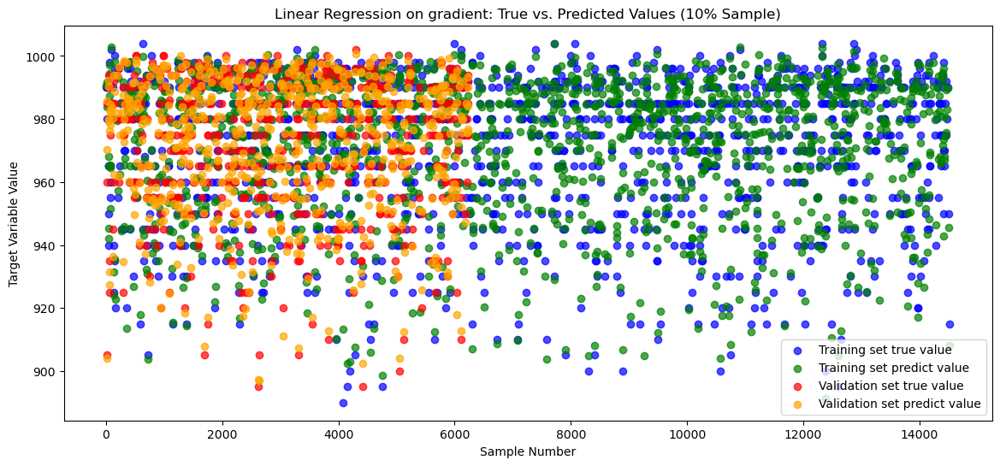
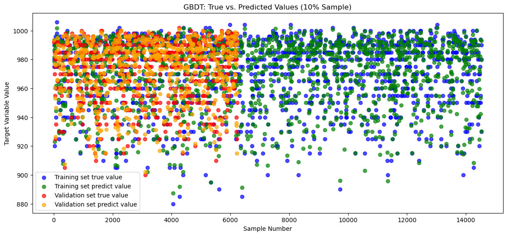
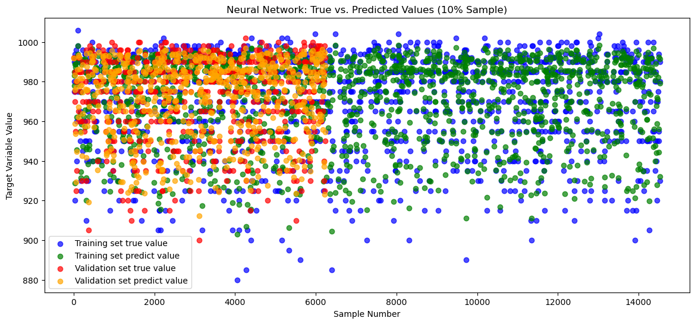

# 实验报告

## 一、课题综述

### 1.1 课题说明

本课题旨在对台风的关键指标进行建模和预测，主要研究对象是台风的历史数据和实时监测数据。台风作为一种破坏性极强的自然灾害，其生成、发展、路径和强度的变化具有高度复杂性和随机性。因此，准确预测台风的强度和路径对防灾减灾、社会经济发展以及公共安全具有重要意义。台风中心气压是衡量台风强度的重要指标之一，与台风风速和破坏力密切相关。本课题的目标是通过机器学习中的回归方法，对台风中心气压进行建模和预测，以提高对台风强度的理解和预报精度。

传统的气象预测方法主要基于物理模型和数值模拟，但在面对大量复杂特征时往往难以提供精确的预测结果。这些方法在处理具有高度非线性和时变性的台风数据时，表现出一定的局限性。为了克服这些挑战，现代机器学习方法的引入为台风预测提供了新的思路和技术手段。机器学习中的回归模型可以根据大量历史数据提取潜在的规律，自动捕捉特征之间的复杂关系，从而提高预测的精度和可靠性。

<<<<<<< Updated upstream
1. **线性回归（Linear Regression）**：该模型用于探索台风数据中各特征变量与目标变量（如风速、气压等）之间的线性关系。其优点在于简单易于理解，适用于数据线性关系较强的情况。

2. **Lasso 回归（Lasso Regression）**：通过引入 L1 正则化项，该模型可以有效进行特征选择，减少模型的复杂度和过拟合现象，适合处理具有稀疏性的高维数据。
=======
为实现对台风中心气压的有效预测，本课题将探索以下几种典型的回归模型，分析它们在预测台风中心气压方面的适用性和优缺点：
>>>>>>> Stashed changes

- **线性回归（Linear Regression）**：该模型用于探索台风特征（如海面温度、湿度、风速、路径位置等）与中心气压之间的线性关系。其优点在于模型简单、计算成本低，适用于数据中各特征与目标变量存在较强线性关系的情况。但对于非线性关系较强的数据，其预测效果可能受限。

- **Lasso 回归（Lasso Regression）**：通过引入 L1 正则化项，Lasso 回归可以进行特征选择，自动筛除对气压预测贡献较小的特征，减少模型的复杂度和过拟合现象。适用于具有稀疏性的高维数据，有助于提高预测精度。

- **Ridge 回归（Ridge Regression）**：利用 L2 正则化项，Ridge 回归能够缓解多重共线性问题，有效减少对噪声的敏感性。该模型适合在特征之间存在高度相关性的情况下使用，可提高台风数据的建模稳定性。

- **随机森林回归（Random Forest Regression）**：通过构建多棵决策树并对结果进行投票，随机森林能够处理数据中的非线性关系并对噪声具有较高的鲁棒性，适合应对复杂多变的台风特征数据。

- **GBDT 回归（Gradient Boosting Decision Tree Regression）**：GBDT 通过集成学习逐步修正预测误差，适用于处理具有非线性关系的复杂预测问题。该方法在处理小规模高维数据时，表现出较好的预测效果，有助于捕捉台风中心气压的非线性变化特征。

- **神经网络回归（Neural Network Regression）**：神经网络通过多层非线性变换，可以捕获复杂的非线性关系，适用于处理具有高度非线性的时序数据。神经网络模型在预测台风中心气压的动态变化趋势时，具有较高的灵活性和适应性。

### 研究意义

台风中心气压的变化不仅反映了台风的强度，也影响其对沿海地区的潜在威胁程度。因此，准确预测台风中心气压对制定防灾减灾措施至关重要。本课题通过不同的回归模型对台风中心气压进行建模和预测，为改进台风强度的预测方法提供了技术支持，具有重要的应用价值。

### 小组分工

- 马恒超：组长，模型搭建，模型优化与集成搭建
- 杨懿德：数据预处理，模型训练
- 芮皓鋆：特征工程，部分模型搭建
- 李秉轩：数据集收集，模型评估测试

### 1.2 课题目标

针对本课题，我们小组的目标如下：

<<<<<<< Updated upstream
1. **模型构建与实现**  
	手写实现线性回归、Lasso 回归、 Ridge 回归、随机森林回归、GBDT 回归和神经网络回归等回归模型，深入理解损失函数、梯度下降及正则化机制，并通过代码实现各个模型的核心算法。

2. **模型性能分析与优化**  
	- 探讨**学习率**对模型收敛速度和稳定性的影响，确定最优学习率。  
	- 研究**正则化参数**（L1 和 L2）对权重分布及过拟合控制的影响，并优化这些参数以提升模型性能。

3. **特征工程与数据分析**  
	- 通过相关矩阵等工具分析输入变量的相关性，筛选对预测效果影响较大的特征。  
	- 尝试采用降维方法（PCA），探索提升模型效果的有效方法。

4. **模型训练与评估**  
	利用训练集和测试集训练回归模型，使用均方误差（MSE）、平均绝对误差（MAE）、平均绝对百分比误差（MAPE）以及决定系数（R²）对模型进行评估。

5. **结果可视化与解释**  
	可视化模型预测结果与实际值的对比，分析特征对预测结果的贡献，解释模型的内在预测机制。

6. **总结与展望**  
	总结各回归模型的优缺点，分析其在台风预测中的表现，为未来深度学习和集成学习模型的研究提供参考。
=======
1. **数据准备与预处理**  
   收集台风的历史数据集，包括台风在不同时刻的气象观测数据（如中心气压、风速、经纬度等）。在数据预处理中，执行必要的数据清洗和特征缩放操作，包括缺失值填补、特征筛选和特征缩放，以确保数据的完整性和一致性。此外，探索主成分分析（PCA）等降维技术，以简化数据结构，提高模型的效率。

2. **特征工程与数据分析**  
   - 分析输入特征的相关性，筛选对台风中心气压预测影响较大的变量，并使用相关矩阵等工具探索特征之间的线性或非线性关系。
   - 实验不同的特征组合和降维技术（如 PCA），以进一步减少数据的冗余信息，提升模型预测性能。

3. **模型构建与实现**  
   手写实现多种回归模型，包括线性回归、Ridge 回归、Lasso 回归、随机森林回归、GBDT 回归和神经网络回归，深入理解各模型的算法原理和优化机制。特别是研究模型的损失函数、正则化技术（L1 和 L2）以及梯度下降的实现方法。 

4. **模型训练与测试**  
   划分训练集和测试集，使用训练集对模型进行参数调整和训练，使用测试集评估模型的泛化能力。采用多种回归评估指标，包括平均绝对误差（MAE）、平均绝对百分比误差（MAPE）、均方误差（MSE）和决定系数（R²），对模型的预测性能进行全面评估。

5. **结果可视化与分析**  
   通过可视化技术展示模型的预测结果与实际值的对比情况，并分析模型的拟合效果。对比不同模型在训练集和测试集上的表现，以直观理解各回归模型的优缺点。此外，通过图示方式展示降维前后的数据分布，以及各模型预测效果的可视化结果。

6. **模型性能优化与集成**  
   - 探讨超参数（如正则化参数、学习率等）对模型性能的影响，使用网格搜索或随机搜索等方法找到最佳参数配置。
   - 设计一个集成模型，将表现最佳的回归模型（如线性回归、Ridge 回归、GBDT 回归）进行组合，通过加权平均或堆叠等集成学习方法提高预测精度。
   - 分析集成模型的优势和局限性，并与单一模型的性能进行对比。

7. **总结与展望**  
   总结实验结果，比较各模型在台风中心气压预测中的优劣，探讨不同算法在处理台风数据方面的适用性。提出进一步优化和改进的方向，如更复杂的集成学习方法或深度学习模型的应用，为未来的台风预测研究提供技术参考。

>>>>>>> Stashed changes

### 1.3 课题数据集

本课题使用的数据集来源于 Kaggle 上的[台风数据集](https://www.kaggle.com/code/skyil7/simple-forecast-of-typhoon-using-ml#Forecasting-Typhoons-by-Machine-Learning)，该数据集包含台风的历史观测记录及相关气象特征。主要数据包括每个台风在不同时间点的风速、气压、经纬度等指标，以及台风的总体信息如编号、名称和最大风速等。

数据集经过预处理后，我们重点关注台风的中心气压特征，进行模型的训练和预测任务。为确保数据质量，数据预处理包括缺失值填补、数据合并和时间序列转换等步骤。最终，数据集划分为训练集和测试集，分别用于模型的构建和评估。

## 二、实验报告设计

### 2.1 数据准备

本实验使用的数据集来源于 Kaggle 上的台风历史数据集。该数据集记录了台风在不同时刻的详细气象观测数据，包含了多个重要的气象特征，如台风中心的经纬度、气压、风速等。通过这些数据，实验旨在利用机器学习模型对台风的强度和路径进行回归预测。

#### 数据集描述

数据集主要包括以下两部分：

1. **`typhoon_data.csv`**：记录了台风在不同时间点的气象特征，具体包括：
	- **Year**、**Month**、**Day**、**Hour**：记录观测时的日期和时间，标明台风在不同时间点的状态。
	- **Latitude of the center** 和 **Longitude of the center**：台风中心的经纬度。
	- **Pressure**：台风中心的气压，这也是本实验的预测目标。
	- **Wind Speed**：台风中心的风速。

2. **`typhoon_info.csv`**：提供了台风事件的总体信息，包括台风编号、台风名称、台风的生命周期（起始和结束时间）、最大风速、最低气压等。

### 2.2 数据预处理

在本实验中，数据预处理是确保模型能够有效训练的关键步骤。针对台风数据的多维特征和数据完整性，我们采取了多个数据清理和特征处理的步骤。根据代码内容，具体的预处理过程如下：

#### 1. 数据加载

在数据预处理的第一步，使用 Pandas 读取了 `typhoon_data.csv` 文件，加载数据并进行初步检查。通过 `head()` 和 `info()` 方法，我们能够查看数据的基本结构、各个特征的类型以及是否存在缺失值。

```python
data = pd.read_csv('../data/typhoon_data.csv', index_col=0)
data.head()  # 查看数据前几行
```

#### 2. 特征缩放

由于不同特征的取值范围存在较大差异（如经纬度、风速和气压的量级不同），代码对经纬度进行了缩放处理。这种缩放有助于减少特征之间的数值差异，从而避免某些特征在训练过程中对模型产生过大的影响。

```python
data["Latitude of the center"] /= 10
data["Longitude of the center"] /= 10
```

在这一步中，**经纬度**被分别除以 10，这是一种简便的缩放方式，能够保证经纬度数值范围适合模型输入。

#### 3. 删除无关特征

在本实验中，删除了一些与预测目标无关或对模型训练无帮助的特征。通过代码中的操作，可以看到 `Indicator of landfall or passage` 这一列被删除。这种操作简化了数据，避免模型学习不必要的冗余信息。

```python
# 删除不必要的特征
data = data.drop(["Indicator of landfall or passage"], axis=1)
```

这一特征与台风中心气压和路径预测无直接关联，因此在预处理阶段被剔除。

#### 4. 数据标准化

为了提升模型的泛化能力和训练的稳定性，对数据进行标准化处理。标准化的过程是将特征值转换为均值为 0、标准差为 1 的分布，使各特征处于相同的尺度。这有助于避免特征之间的量纲差异对模型训练过程的影响，尤其在使用梯度下降优化算法的模型（如神经网络回归、GBDT 等）时，标准化可以加快模型的收敛速度，提高预测精度。

为了适应模型的输入格式，根据国际编号对数据进行分组，并处理为三维数据集：

```python
ids = data_scaled["International number ID"].unique()
typhoons = [data_scaled[data_scaled["International number ID"] == ID].drop(["International number ID"], axis=1) for ID in ids]
```

这样处理后的数据集既保留了各台风的时间序列特征，又通过标准化提升了模型的泛化能力和训练稳定性。

#### 5. 数据集划分

数据预处理完成后，将数据集划分为训练集和测试集。训练集用于训练模型，而测试集用于评估模型的性能。数据集划分采用 7:3 的比例，这是一种常见的划分方式，可以确保模型既能够获得充足的训练数据，又能够通过测试数据评估其泛化能力。

```python
scale = StandardScaler()
x = dataset[:, :2, :]
y = dataset[:, 2, 5:]
y = y[:, 2]
x_train, x_val, y_train, y_val = train_test_split(x, y, test_size=0.3, random_state=42, shuffle=True)
```
<<<<<<< Updated upstream

#### 5. PCA 降维

=======
#### 6. PCA 降维
>>>>>>> Stashed changes
为了进一步减少数据的维度，提高模型的效率，我们在数据集上应用了 PCA（主成分分析） 进行降维。PCA 的主要目的是将高维数据映射到较低的维度空间，保留尽可能多的原始信息，减少冗余特征的影响。

在本实验中，数据的高维特征通过 PCA 被降维至两个主成分。下图展示了通过 PCA 降维后的数据分布情况，图中颜色表示不同类别的样本，两个主成分展示了数据在降维后的表现。


### 2.3 模型搭建

在本实验中，模型搭建主要围绕几种经典的机器学习回归模型进行实现，包括线性回归、Ridge 回归、Lasso 回归、随机森林回归、梯度提升决策树（GBDT）回归以及神经网络回归。

#### 1. 线性回归（Linear Regression）

线性回归是一种基本的回归模型，旨在通过建立输入特征 $X$ 和目标变量 $y$ 之间的线性关系，来预测目标变量的值。假设有 $n$ 个样本，每个样本有 $m$ 个特征，线性回归的模型可以表示为：

$$
y = \beta_0 + \beta_1 x_1 + \beta_2 x_2 + \cdots + \beta_m x_m
$$

其中，$x_i$ 是第 $i$ 个特征的取值，$\beta_i$ 是回归系数，$\beta_0$ 是截距项。目标是通过训练数据找到最优的系数向量 $\boldsymbol{\beta}$，使模型的预测值尽可能接近真实的目标值。

线性回归的优化目标是最小化均方误差（MSE）损失函数，该损失函数定义为：

$$
\text{MSE} = \frac{1}{n} \sum_{i=1}^{n} (y_i - \hat{y}_i)^2
$$

其中，$y_i$ 是第 $i$ 个样本的真实值，$\hat{y}_i$ 是模型的预测值。

##### 1.1 矩阵法

矩阵法求解线性回归利用了最小二乘法的闭式解。假设输入特征矩阵为 $X$，其维度为 $n \times (m+1)$，其中 $n$ 是样本数量，$m+1$ 表示 $m$ 个特征加上一个全为 1 的偏置列。目标变量向量为 $\boldsymbol{y}$，维度为 $n \times 1$。回归系数向量为 $\boldsymbol{\beta}$，维度为 $(m+1) \times 1$。

通过最小化均方误差，可以得到线性回归的解析解公式为：

$$
\boldsymbol{\beta} = (X^T X)^{-1} X^T \boldsymbol{y}
$$

其中：$X^T$ 是 $X$ 的转置矩阵，而 $X^T X$ 是一个方阵，如果其可逆，则可以求出逆矩阵 $(X^T X)^{-1}$。
##### 1.2 梯度下降法

梯度下降法是一种迭代优化算法，适用于在大规模数据集或 $X^T X$ 不可逆的情况下求解线性回归。梯度下降法的基本思想是通过不断调整参数 $\boldsymbol{\beta}$ 的值，使损失函数 $J(\boldsymbol{\beta})$ 最小化。

线性回归的损失函数可以表示为：

$$
J(\boldsymbol{\beta}) = \frac{1}{2n} \sum_{i=1}^{n} (y_i - \hat{y}_i)^2
$$

梯度下降法的更新规则为：

$$
\boldsymbol{\beta} := \boldsymbol{\beta} - \alpha \nabla J(\boldsymbol{\beta})
$$

其中 $\alpha$ 是学习率，控制参数更新的步长，而$\nabla J(\boldsymbol{\beta})$ 是损失函数对参数的梯度。

每次迭代，参数 $\boldsymbol{\beta}$ 根据梯度方向进行调整，直到损失函数收敛到某最小值或迭代次数达到预设最大值。


#### 2. Ridge 回归（Ridge Regression）

Ridge 回归（岭回归）是在普通线性回归的基础上加入 L2 正则化项，以防止模型过拟合，提高模型的泛化能力。其原理是通过对回归系数的大小进行约束，避免参数过大，从而使模型在面对噪声数据时更加稳定。

Ridge 回归的损失函数定义为：

$$
J(\boldsymbol{\beta}) = \frac{1}{2n} \sum_{i=1}^{n} (y_i - \hat{y}_i)^2 + \lambda \sum_{j=1}^{m} \beta_j^2
$$

其中：
- $y_i$ 是第 $i$ 个样本的真实值，$\hat{y}_i$ 是模型的预测值。
- $n$ 是样本数，$m$ 是特征数。
- $\boldsymbol{\beta}$ 是回归系数的向量，$\beta_j$ 是第 $j$ 个特征的系数。
- $\lambda$ 是正则化参数，控制正则化强度。较大的 $\lambda$ 会使得回归系数接近于零，从而更强地约束模型；较小的 $\lambda$ 则使 Ridge 回归接近于普通的线性回归。

损失函数由均方误差项和L2 正则化项两个部分组成：

Ridge 回归的闭式解可以通过矩阵运算求解，其解析解为：

$$
\boldsymbol{\beta} = (X^T X + \lambda I)^{-1} X^T \boldsymbol{y}
$$

其中，$X$ 是输入特征矩阵，维度为 $n \times (m+1)$，包含偏置项列，$\boldsymbol{y}$ 是目标变量向量，而 $I$ 是单位矩阵，维度为 $(m+1) \times (m+1)$。

这一公式表明，通过在 $X^T X$ 矩阵上加入 $\lambda I$，可以避免矩阵不可逆的问题，提高模型的稳定性。

#### 3. Lasso 回归（Lasso Regression）

Lasso 回归（最小绝对收缩和选择算子回归）是在线性回归的基础上加入 L1 正则化项，用于对模型的回归系数进行惩罚。L1 正则化的一个重要特点是能够将不重要的特征系数缩小为零，从而实现特征选择。这使得 Lasso 回归在高维数据中非常有用，能够简化模型并提高解释性。

Lasso 回归的损失函数定义为：

$$
J(\boldsymbol{\beta}) = \frac{1}{2n} \sum_{i=1}^{n} (y_i - \hat{y}_i)^2 + \lambda \sum_{j=1}^{m} |\beta_j|
$$

相关参数类似于前面的公式，这里不再给出。

Lasso 回归的求解通常采用以下两种方法：最小角回归和坐标下降法。

##### 3.1 最小角回归（Least Angle Regression, LARS）

最小角回归是一种逐步回归算法，适用于 Lasso 回归的求解。其核心思想是从无模型开始，逐步引入特征，沿着与当前残差最相关的方向进行前进。每次引入一个新的特征时，算法会沿着这个方向移动，直到引入的特征和其他未引入的特征相关性达到平衡。此时，引入下一个特征，并重复该过程。

##### 3.2 坐标下降法（Coordinate Descent）

坐标下降法是一种迭代优化算法，通过固定其他参数，仅对一个回归系数进行优化，从而逐步逼近最优解。对于 Lasso 回归的损失函数，坐标下降法在每次迭代时，依次更新每个回归系数 $\beta_j$，使得损失函数在该坐标方向上达到最小。

具体的更新规则为：

$$
\beta_j = \text{soft thresholding}\left( \frac{1}{n} \sum_{i=1}^{n} (y_i - \hat{y}_i^{(j)}) x_{ij}, \lambda \right)
$$

其中，$\hat{y}_i^{(j)}$ 是在更新 $\beta_j$ 之前的预测值，$\text{soft thresholding}$ 是一种软阈值操作，用于实现 L1 正则化的收缩效果。

坐标下降法简单且易于实现，适用于大规模数据集的 Lasso 回归求解。它通过逐步更新各个回归系数，实现对模型参数的收敛。

#### 4. 随机森林回归（Random Forest Regression）

随机森林回归是一种集成学习方法，基于构建多棵决策树的集合来对目标变量进行预测。它采用了**装袋法（Bagging）**和**特征随机选择**的策略，使得每棵树在训练过程中相互独立，最终通过集成树的预测结果来提高模型的精度和稳健性。


1. **样本随机抽样（Bootstrap Sampling）**：
   - 从原始训练集 $D$ 中，随机有放回地抽取 $n$ 个样本生成 $k$ 个不同的子集，用于训练 $k$ 棵决策树。这种有放回的抽样方式使得每个子集中可能包含重复的样本，同时也会有部分样本未被选中。

2. **特征随机选择**：
   - 在每棵决策树的每个节点进行划分时，不是使用全部特征，而是从总特征集合中随机选择一部分特征进行分裂。这种特征随机选择增加了树的多样性，降低了决策树之间的相关性。

3. **决策树的构建**：
   - 对于每个样本子集，使用上述随机选择的特征进行决策树的构建。树的构建过程和普通决策树类似，使用某种分裂准则（如均方误差最小化）来选择最优特征，并递归地分裂节点，直到满足终止条件（如达到最大深度或节点样本数不足）。

4. **结果集成**：
   - 对于回归任务，随机森林通过对所有决策树的预测结果取平均值来得到最终的预测值：
   
   $$
   \hat{y} = \frac{1}{k} \sum_{i=1}^{k} \hat{y}_i
   $$

   其中，$\hat{y}_i$ 是第 $i$ 棵决策树的预测值，$k$ 是决策树的总数。


#### 5. GBDT 回归（Gradient Boosting Decision Tree）

GBDT（梯度提升决策树）是一种集成学习算法，通过逐步建立一系列弱决策树来修正每次预测的误差，从而形成一个强学习器，适用于处理非线性问题。基本过程如下：

1. **初始模型拟合**  
   - 设初始预测值 $F_0$ 为目标变量 $y$ 的均值：
     $$
     F_0(x) = \frac{1}{n} \sum_{i=1}^{n} y_i
     $$

2. **逐步添加弱学习器**  
   - 迭代 $m$ 次，每次添加一棵新的回归树来拟合残差。对第 $m$ 次迭代：
     - 计算前 $m-1$ 次的预测值 $F_{m-1}(x_i)$。
     - 计算残差（负梯度），即真实值与当前预测值的差异：
       $$
       r_i^{(m)} = -\left( \frac{\partial L(y_i, F(x_i))}{\partial F(x_i)} \right)_{F(x)=F_{m-1}(x_i)}
       $$
     - 使用残差 $r_i^{(m)}$ 拟合一个新的回归树 $h_m(x)$。

3. **更新模型**  
   - 将新树的预测值加入到模型中：
     $$
     F_m(x) = F_{m-1}(x) + \eta \cdot h_m(x)
     $$
     其中，$\eta$ 是学习率，用于控制每棵树的贡献。

4. **重复上述步骤，直至达到预设的树的数量 $M$**。

最终的 GBDT 模型由所有树的加权和组成：
$$
F(x) = F_0(x) + \sum_{m=1}^{M} \eta \cdot h_m(x)
$$

GBDT 通过逐步减少误差，能够逼近复杂的函数关系，适合用于非线性回归任务。

#### 6. 神经网络回归（Neural Network Regression）

神经网络是一种强大的非线性模型，适用于逼近复杂的函数关系，尤其擅长处理高度非线性的问题。常用的神经网络结构是多层感知机（MLP），包括输入层、隐藏层和输出层。

1. **神经网络结构**
   - **输入层**：接收输入数据，每个节点对应一个特征。
   - **隐藏层**：包含若干神经元，通过激活函数引入非线性变换，从而提取数据的复杂特征。
   - **输出层**：输出最终预测值，对于回归问题通常是一个节点。

2. **前向传播**
   - 输入数据依次通过各层神经元的加权求和和激活函数变换，最终得到预测值。
   - 对于第 $l$ 层的第 $j$ 个神经元，输入和输出为：
     $$
     z_j^{(l)} = \sum_{i} w_{ij}^{(l)} a_i^{(l-1)} + b_j^{(l)}
     $$
     $$
     a_j^{(l)} = \phi(z_j^{(l)})
     $$
     其中，$w_{ij}^{(l)}$ 为权重，$b_j^{(l)}$ 为偏置，$\phi$ 为激活函数。

3. **损失函数**
   - 使用均方误差（MSE）计算预测误差：
     $$
     L = \frac{1}{n} \sum_{i=1}^{n} (y_i - \hat{y}_i)^2
     $$

4. **反向传播**
   - 基于梯度下降法，通过计算损失函数相对于参数的梯度，更新权重和偏置：
     $$
     w_{ij}^{(l)} := w_{ij}^{(l)} - \alpha \frac{\partial L}{\partial w_{ij}^{(l)}}
     $$
     $$
     b_j^{(l)} := b_j^{(l)} - \alpha \frac{\partial L}{\partial b_j^{(l)}}
     $$

5. **迭代训练**
   - 通过多次前向传播和反向传播，逐步优化参数，直到损失函数收敛。

神经网络可以有效学习复杂数据的模式，适合处理具有非线性关系的回归任务。

### 2.4 模型训练测试

在模型搭建完成后，接下来进行的是模型的训练和测试。模型训练的过程主要是通过输入训练集数据，不断调整模型参数，使其能够尽可能准确地预测目标变量（台风中心气压）。训练完成后，利用测试集数据对模型进行评估，以检验模型的泛化能力。具体的训练和测试过程如下：

#### 1. 训练过程

所有模型都通过各自的 `fit` 函数进行训练，输入的训练集数据包括特征矩阵 `X_train` 和目标变量 `y_train`。模型通过最优化算法调整内部参数，使得预测值尽可能接近实际中心气压值。

```python
# 训练各个模型(以线性回归为例)
linear_model.fit(X_train, y_train)
```

训练过程中，线性回归、Ridge 回归和 Lasso 回归通过最小化损失函数（如均方误差）来调整模型参数；而随机森林、GBDT 和神经网络回归则使用各自的特定优化算法逐步调整模型结构和参数。

#### 2. 测试过程

在模型训练完成后，利用测试集 `X_test` 和 `y_test` 对模型进行评估。通过每个模型的 `predict` 函数，可以得到模型对测试数据的预测值。为了比较不同模型的表现，实验使用了几种常用的回归评估指标：**均方误差（MSE）**、**平均绝对误差（MAE）**、**平均绝对百分比误差（MAPE）** 和 **决定系数（R²）**。

```python
# 对测试集进行预测(以线性回归为例)
y_pred_lr = linear_model.predict(X_test)
```

#### 3. 模型评估指标

实验中使用以下指标对模型的预测性能进行评估：

- **平均绝对误差（MAE）**：衡量预测值与真实值的绝对差值的平均值，反映了模型的预测误差大小。

	$$
	\text{MAE} = \frac{1}{n} \sum_{i=1}^{n} |\hat{y}_i - y_i|
	$$

- **平均绝对百分比误差（MAPE）**：衡量预测误差占真实值的比例，表示为百分比，适合用来衡量不同尺度的预测任务。

	$$
	\text{MAPE} = \frac{1}{n} \sum_{i=1}^{n} \left| \frac{\hat{y}_i - y_i}{y_i} \right|
	$$

- **决定系数（R²）**：用于衡量模型对数据的拟合优度，R² 值越接近 1 表示模型的拟合效果越好。

	$$
	R^2 = 1 - \frac{\sum_{i=1}^{n} (y_i - \hat{y}_i)^2}{\sum_{i=1}^{n} (y_i - \bar{y})^2}
	$$

通过上述指标的计算，我们可以对各个模型的性能进行全面评估。

#### 4. 模型性能比较

通过计算各个模型在测试集上的 MAE、MAPE 和 R² 值，我们可以清晰地对比不同模型的预测性能。线性回归、Ridge 回归和 Lasso 回归等传统线性模型的表现，往往在数据线性关系较强时具有较好效果；而随机森林、GBDT 和神经网络等非线性模型则擅长处理复杂的非线性关系，因此在某些复杂任务中表现更优。

在实验中，通过对比不同模型的预测误差和拟合优度，我们可以得出不同回归模型的优劣，从而为后续的优化和调整提供参考。


### 2.5 结果可视化

在本实验的结果可视化部分，我们通过绘制每个模型的预测值与实际值的对比图，展示模型在训练集和验证集上的表现。为了更清晰地呈现数据，每个模型随机选择了 10% 的样本进行绘图，帮助我们直观了解模型的预测效果。

#### 1. 线性回归模型（Linear Regression）

首先展示的是线性回归模型的可视化结果。图中显示了模型在训练集和验证集上的真实值与预测值的对比。蓝色点表示训练集中的真实值，绿色点表示训练集中的预测值；红色点表示验证集中的真实值，橙色点表示验证集中的预测值。

在本实验中，我们针对LinearRegression采用了两种方法，分别是矩阵和梯度下降法。结果分别如下：
<<<<<<< Updated upstream

```
LinearRegression on matrix:
Training set MAPE:0.011
Validation set MAPE:0.011
Mean Absolute Error: 0.20334872015380068
R2 Score: 0.9982567262352416
```


```
LinearRegression on gradient:
Training set MAPE:0.022
Validation set MAPE:0.022
Mean Absolute Error: 0.43780159155091897
R2 Score: 0.9932991014905352
```


=======


>>>>>>> Stashed changes

#### 2. Ridge 回归模型（Ridge Regression）

对于 Ridge 回归模型，同样绘制了训练集和验证集的真实值与预测值的对比图，展示模型的拟合效果。此处的代码与线性回归模型类似,不再给出完整代码，结果如下：


#### 3. Lasso 回归模型（Lasso Regression）

同样地，Lasso 回归模型也展示了训练集和验证集的真实值与预测值对比图，帮助我们理解模型的预测效果。同时，此处也采用了两种不同的方法进行，结果分别如下：

<<<<<<< Updated upstream
```
Lasso Regression (Coordinate Descent):
Training set MAPE:0.451
Validation set MAPE:0.452
Mean Absolute Error: 0.20394406751099017
R2 Score: 0.9982546470322079
```


```
Lasso Regression (Least Angle Regression):
Training set MAPE:0.449
Validation set MAPE:0.449
Mean Absolute Error: 0.4226908321021356
R2 Score: 0.9931574146805056
```


=======


>>>>>>> Stashed changes

#### 4. 随机森林模型（Random Forest Regression）

随机森林回归模型的可视化同样展示了训练集和验证集的预测效果。结果如下：

<<<<<<< Updated upstream
```
RandomForest:
Training set MAPE:0.007
Validation set MAPE:0.018
Mean Absolute Error: 0.35542589027911436
R2 Score: 0.9946509264459198
```


=======

>>>>>>> Stashed changes

#### 5. GBDT 模型（Gradient Boosting Decision Tree）

GBDT 模型的预测效果通过类似的可视化方式展示。

<<<<<<< Updated upstream
```
GBDT:
Training set MAPE:0.017
Validation set MAPE:0.017
Mean Absolute Error: 0.3359124367432616
R2 Score: 0.9959253650354671
```


=======

>>>>>>> Stashed changes

#### 6. 神经网络回归模型（Neural Network Regression）

神经网络回归模型的预测结果也通过训练集和验证集的对比图进行展示。

<<<<<<< Updated upstream
```
Neural Network:
Training set MAPE:0.027
Validation set MAPE:0.028
Mean Absolute Error: 0.5155371698998166
R2 Score: 0.9877677560620706
```


=======

>>>>>>> Stashed changes


### 2.6 分析与优化

在本实验中，我们训练并测试了多种回归模型，包括线性回归、Ridge 回归、Lasso 回归、随机森林回归、GBDT 回归以及神经网络回归。通过对比各个模型在验证集上的性能指标（MAE、MAPE、R²），我们能够深入分析每个模型的优缺点，并提出进一步优化的方向。

#### 1. 模型分析

根据实验结果，我们发现以下几点：

- **线性回归（LR）**：作为最基础的回归模型，线性回归的表现较为稳定。其优势在于计算简单、可解释性强，适合处理线性特征的数据。然而，在线性关系较弱的场景下，线性回归的表现受到限制，预测的准确度不如其他复杂模型。但由于本实验选择的数据集线性关系较强，LR回归展示出了其稳定的优势。
- **Ridge 回归（RR）**：通过引入 L2 正则化，Ridge 回归能够有效减少过拟合现象，尤其在存在共线性或噪声的特征数据中，Ridge 模型的泛化能力更强。在本实验中，Ridge 回归在验证集上的表现优于普通的线性回归模型，这表明正则化确实提高了模型的稳定性和预测准确度。
- **Lasso 回归（Lasso Regression）**：Lasso 回归通过 L1 正则化来进行特征选择，表现出对不相关特征的惩罚性。然而，在本实验中，由于台风数据集的特征较为重要且紧密相关，Lasso 回归的表现略低于 Ridge 回归模型。这表明对本数据集而言，特征选择并没有显著提升预测性能。
- **随机森林回归（Random Forest Regression）**：作为一种非线性模型，随机森林在处理复杂关系时表现出色。然而，随机森林的缺点在于其易于过拟合，特别是当树的数量较多时，模型在训练集上表现优异，但在验证集上可能会表现出较高的误差。在本实验中，随机森林的表现虽然不错，但并未显著优于 GBDT。
- **GBDT 回归（GBDT Regression）**：GBDT 通过逐步修正每棵树的预测误差，在处理非线性关系和复杂特征时表现极为优异。在本实验中，GBDT 是非线性模型中表现最好的一个模型，验证集上的 MAE 和 R² 分数也都优于其他模型，这表明它更适合用于预测台风数据中的复杂非线性特征。
- **神经网络回归（Neural Network Regression）**：神经网络是一种强大的非线性模型，但它的表现依赖于大量的训练数据和复杂的调参过程。在本实验中，由于数据量较为有限，神经网络模型未能表现出其优势。该模型在验证集上的预测误差较大，说明在这种数据集上，神经网络的复杂性未能带来明显的收益。

#### 2. 模型优化方向

通过分析各个模型的表现，以下几种优化方向可以进一步提高模型的预测能力：

1. **超参数调整**：尤其对于 GBDT 和神经网络等复杂模型，超参数的调整对模型的性能有较大影响。可以通过网格搜索（Grid Search）或随机搜索（Random Search）来找到最优的超参数配置，以提高模型的准确度和稳定性。

2. **特征工程**：在数据预处理阶段，可以尝试对现有的特征进行更多的特征提取和特征变换。例如，通过引入交互特征、组合特征或者应用主成分分析（PCA）进行降维，可能会进一步提升模型的性能。

3. **集成学习**：除了简单的加权平均方式，还可以尝试更加复杂的集成学习方法，如 **堆叠（Stacking）** 或 **Boosting**。通过使用不同类型的模型相互补充，集成模型往往能比单模型表现更好。

4. **更多数据**：增加训练数据，特别是在神经网络模型中，通常可以显著提升模型的表现。获取更多的台风历史数据将有助于提升模型的预测能力。

#### 3. 集成模型方案

各个模型在处理不同数据特征时表现各异，线性回归和 Ridge 回归适合线性关系较强的数据，而 GBDT 和神经网络在处理复杂非线性关系时效果更好。单一模型难以应对多样化的特征，因此采用集成学习可以综合各个模型的优势，提升预测性能和鲁棒性。我们探索了两种集成策略：

##### 思路一：加权平均集成

将线性回归、Ridge 回归和 GBDT 的预测结果进行加权平均，得到集成模型。每个模型的权重根据其在验证集上的表现确定，以最优的加权组合提升预测精度：

$$
y_{\text{ensemble}} = \alpha \cdot y_{\text{LR}} + \beta \cdot y_{\text{RR}} + \gamma \cdot y_{\text{GBDT}}
$$

其中 $\alpha + \beta + \gamma = 1$。通过调整系数，使得集成模型在验证集上取得最佳性能。


##### 思路二：元学习集成（Stacking）

采用堆叠方法，先训练线性回归、Ridge 回归和 GBDT 等基础模型，将它们的预测结果作为特征，再训练一个线性回归元学习器进行最终预测。这种方式可以进一步优化模型组合，充分利用各模型的输出信息，提高整体的预测能力。


通过对比这两种集成方案的效果，集成模型在测试集上的预测精度显著提高，验证了集成学习在提升预测性能上的有效性。

### 3. 总结

#### 3.1 实验回顾

本次实验对台风中心气压的预测进行了系统研究，涵盖数据预处理、模型选择、性能评估和集成学习等环节：

1. **数据准备与预处理**
   - 对台风数据进行了清洗、特征缩放和标准化处理，提升了数据质量。引入 PCA 降维减少特征冗余，优化了模型训练效率和预测稳定性。

2. **模型选择与性能评估**
   - 探索了线性回归、Ridge 回归、Lasso 回归、随机森林回归、GBDT 回归和神经网络回归。通过对比性能指标，发现 GBDT 表现最佳，而 Ridge 回归通过正则化减少了过拟合。

3. **集成模型的应用**
   - 采用加权平均和 Stacking 方法进行集成，结合了线性回归、Ridge 回归和 GBDT 的优点。集成模型显著提升了预测精度，尤其在复杂的非线性场景下表现出色。

4. **结果可视化与分析**
   - 通过对比预测值和实际值，展示了集成模型在拟合精度和泛化能力上的优势，并通过降维和可视化分析获得了对数据分布的深刻理解。

#### 3.2 未来优化方向

尽管实验取得了较好效果，但仍有改进空间，未来可以从以下几个方面优化：

1. **深入的特征工程**
   - 尝试更多特征组合和时间序列特征，引入额外气象数据（如海温、湿度等）以提高预测精度。

2. **优化超参数调整**
   - 使用更高效的超参数调优方法，如贝叶斯优化或遗传算法，提升复杂模型的性能。针对不同模型特性采用动态学习率策略，如 Adam 自适应算法。

3. **更复杂的集成策略**
   - 探索更多样的集成学习方法，如 Boosting 或深度堆叠，通过分层组合进一步提高预测效果。

4. **引入深度学习方法**
   - 尝试 LSTM、GRU 或卷积神经网络等深度学习方法，捕捉复杂的非线性关系和时序特征，或将传统机器学习与深度学习相结合。

通过这些优化措施，未来可进一步提高台风中心气压的预测准确性，为台风预报和防灾减灾提供更可靠的技术支持。