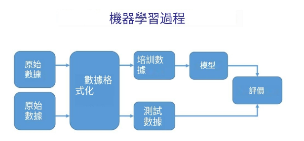
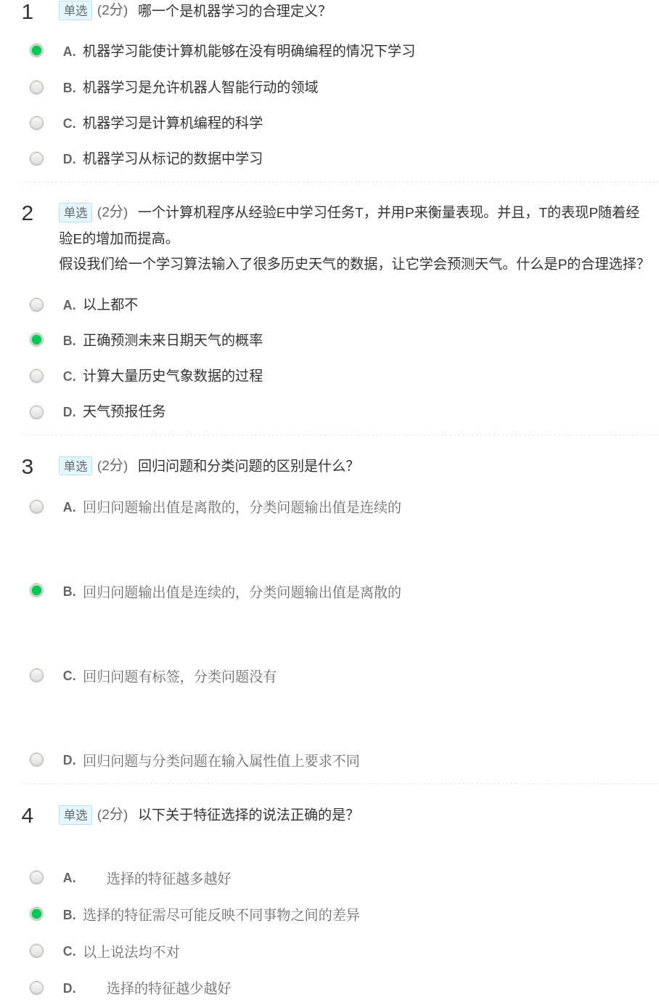
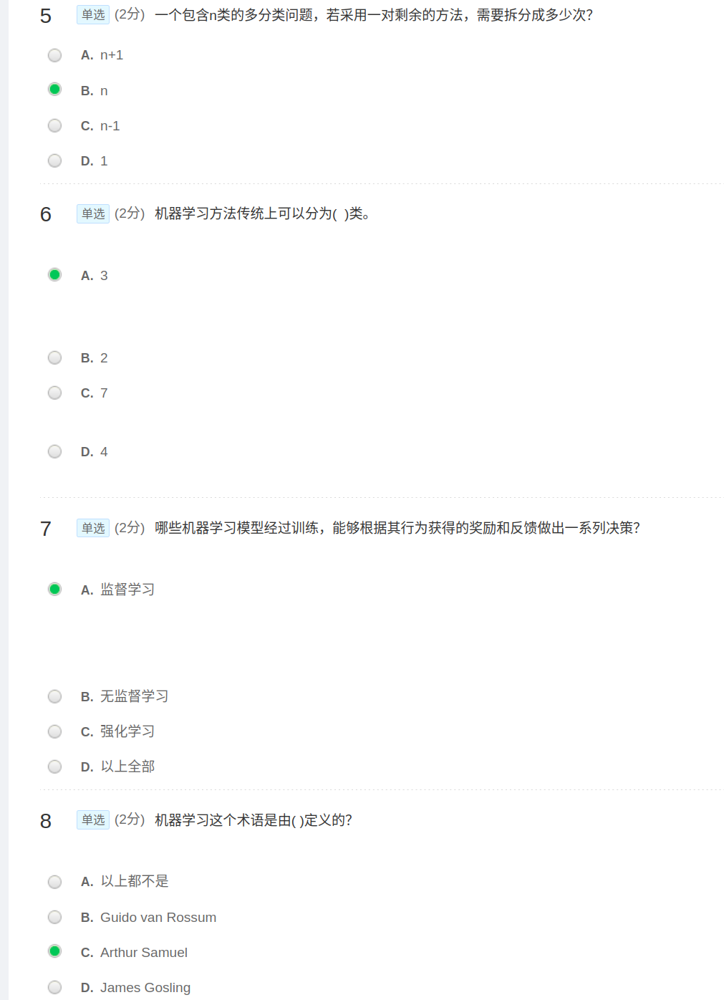
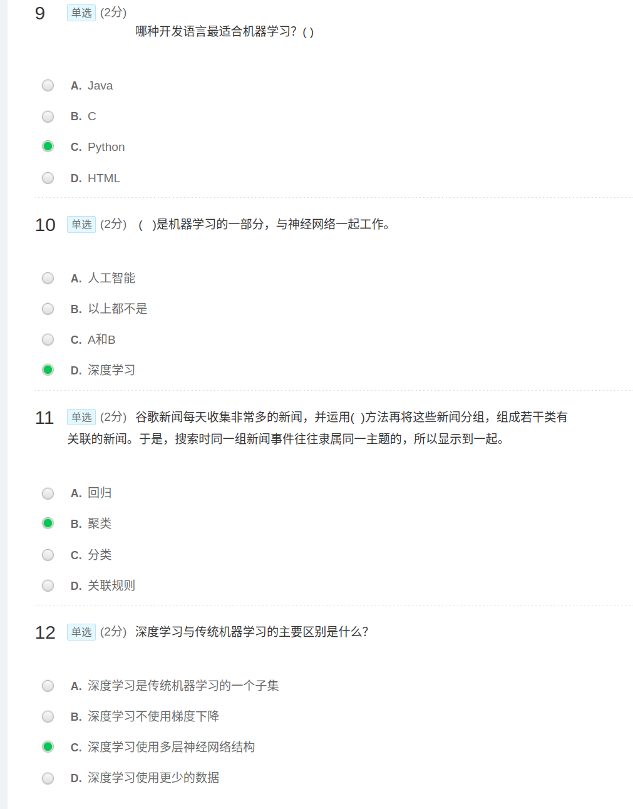
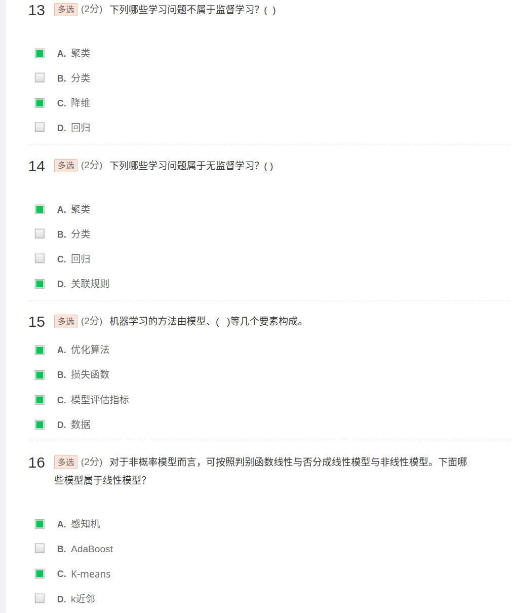
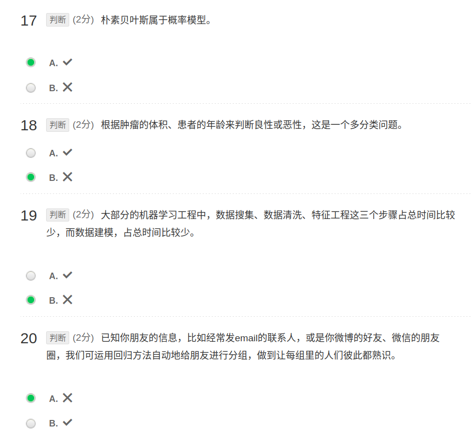

# 机器学习期末复习

## 课程知识点整理(内容过多，整理不过来)

### 一.开学篇

**人工智能的方法论分类**:

1. 基于规则的方法：通过直接编程实现，灵感来自人类的启发式规则
2. 基于数据的方法：
   1. 专家系统：依赖于专家或统计学家根据数据创建预测或决策规则
   2. 机器学习：基于数据科学，根据数据直接作出预测或决策

**机器学习的定义**：目标是使计算机系统能够从数据中学习并自动提取模式、进行预测或做出决策，而无需明确的指令。

**学习任务的类型**：

1. 监督学习：从带有标签的训练数据中推断出一个函数
   1. 监督学习一般由三部分组成：数据 + 模型 + 优化
   2. 优化的目标通常是最小化损失函数，以下是常见的损失函数：
      1. 0-1损失函数：当预测结果与标签不一致时为1，否则为0
      2. 平方损失函数/均方误差（MSE）
      3. 绝对损失函数：绝对差
      4. 对数损失函数：常用于分类问题
      5. 交叉熵损失函数：常用于决策树的分类，$L(Y, P) = - \sum(Y_i * log(P_i))$
   3. 定义完损失函数后，需要定义如何对参数进行更新，以下是常见的参数更新方法：
      1. 梯度下降法
      2. 随机梯度下降法：与梯度下降法类似，但每次更新只使用一个样本或一批样本的梯度来估计整体，减少开销
      3. 牛顿法：利用损失函数的二阶导数信息来进行参数更新
   4. 正则化：L2-norm和L1-norm是常见的正则化项，用于在训练过程中对模型的参数进行约束，以避免过拟合或提高模型的稀疏性。
      1. L2-norm的特点是，它倾向于使模型的参数分布更加平滑，避免参数过大。通过在损失函数中加入L2-norm项，并通过调节正则化参数 的大小，可以控制正则化的程度。L2正则化有助于降低模型对训练数据的过拟合风险。
      2. L1-norm的特点是，它倾向于产生稀疏的参数解，即将一些参数置为零，从而使得模型更加简洁和可解释。L1正则化在特征选择和模型压缩等任务中具有重要作用。
   5. 超参数：是关于模型的高层概念，如模型的复杂度或学习能力等。它们在标准模型训练过程中无法直接从数据中学习，需要预先定义。可以通过设置不同的值、训练不同的模型，并选择测试效果更好的值来确定超参数。
   6. 假设空间：一个监督学习机器可以被看作是一个探索“假设空间”(Hypothesis Space)的设备。
2. 无监督学习：尝试在没有标签的训练数据中找到隐藏的结构。
3. 强化学习：学习在动态环境中采取行动的策略，并获取奖励。

|              | **监督学习**              | **无监督学习**              |
|--------------|----------------------------|-----------------------------|
| **离散**     | 分类 (Classification or Categorization) | 聚类 (Clustering)          |
| **连续**     | 回归 (Regression)         | 降维 (Dimensionality Reduction) |

**机器学习的一般过程**：



1. 原始数据收集
2. 数据形式化处理
3. 训练数据准备
4. 测试数据准备
5. 模型选择和训练
6. 模型评估

**思考题：分别举出一个监督学习和非监督学习的例子。**

**监督学习的例子：**  

1. **分类任务：** 根据患者的症状，预测其是否患有某种疾病。模型使用已标记的患者数据（患病/未患病）进行训练，学习后可对新患者进行疾病预测。  
2. **回归任务：** 根据房屋特征（面积、位置、卧室数量等），预测房屋价格。模型通过历史房屋数据（特征与价格）进行训练，最终对新房屋进行价格估计。  

**非监督学习的例子：**  

1. **聚类任务：** 根据客户的购买行为，将客户分为不同的群体，以便进行市场细分，了解每个群体的购买偏好。  
2. **降维任务：** 在处理高维数据时（如图像数据或基因数据），使用降维技术（如PCA主成分分析）减少数据的特征维度，同时保留主要信息，便于后续分析或可视化。  

### 二.线性回归

### 三.线性分类(= 线性回归 + 激活函数 + 降维)

### 四.决策树

### 五.神经网络

### 六.深度学习

### 七.SVM

### 八.贝叶斯

### 九.聚类

### 十.集成学习

### 十一.降维

## 机器学习(样题)

### 一、单选题

线性回归中，我们可以使用最小二乘法来求解系数，下列关于最小二乘法说法错误的是 (C)
A、不需要迭代训练                   B、只适用于线性模型求解
C、需要选择学习率                   D、当特征数量很多的时候，运算速度会很慢

### 二、多选题

1、降维的优点有哪些 （ABCD）
A. 方便实现数据可视化
B. 消除冗余特征
C. 减小训练时间
D. 提高学习性能

### 三、判断题

1、随机梯度下降，每次迭代时候，使用一个样本。（√）

## 中国慕课课后题(根据上面的三个题溯源到的)

有个缺点就是没答案

### 引言







上述的错误答案：
第5题，应该选择n - 1次
第7题，应该选择强化学习
第16题，选择A、C、D
第19题，是错误

### 回归

1. 单选（2分）哪些算法不需要数据归一化？
    - A. kNN
    - B. XGBoost
    - C. k-means
    - D. SVM

    答案：B. XGBoost

    解释：XGBoost 是基于树模型的算法，不需要数据归一化。kNN、k-means 和 SVM 这些算法对数据的距离或范围敏感，因此需要数据归一化。

2. 单选（2分）以下哪些方法不能用于处理失衡问题？
    - A. 增加新的特征
    - B. 增大正则化系数
    - C. 对特征进行变换，使用组合特征或高阶特征
    - D. 增加模型复杂度

    答案：B. 增大正则化系数

    解释：增大正则化系数主要用于防止过拟合，而不是处理数据失衡问题。处理失衡问题的方法包括重采样、增加新的特征、对特征进行变换等。

3. 单选（2分）以下哪些方法不能用于处理过拟合？
    - A. 对数据进行清洗
    - B. 增大正则化超参的量
    - C. 增加数据量性的复杂度
    - D. 利用正则化技术

    答案：C. 增加数据量性的复杂度

    解释：

4. 单选（2分）方差膨胀因子 VIF X 之间的线性关系，X 是连续变量，使用下列哪种图形比较适合？
    - A. 柱形图
    - B. 以上都不对
    - C. 散点图
    - D. 直方图

    答案：C. 散点图

    解释：散点图适合展示两个连续变量之间的关系，可以直观地显示方差膨胀因子 VIF 与连续变量 X 之间的线性关系。柱形图和直方图主要用于展示分类数据或单一变量的分布情况。

5. 单选（2分）岭回归在训练一个线性回归模型，则：
    1. 如果数据量较少，容易发生过拟合。
    2. 如果假设空间较小，容易发生过拟合。
    关于这两句话，下列说法正确的是？
    - A. 1和2都正确
    - B. 1正确，2错误
    - C. 1和2都错误
    - D. 1错误，2正确

    答案：B. 1正确，2错误

    解释：

6. 单选（2分）关于特征选择，下列对 Ridge 回归和 Lasso 回归说法正确的是？
    - A. Lasso 回归适用于特征选择
    - B. Ridge 回归适用于特征选择
    - C. 以上说法都不对
    - D. 两个都适用于特征选择

    答案：A. Lasso 回归适用于特征选择

    解释：Lasso 回归通过 L1 正则化可以使一些特征的系数变为零，从而实现特征选择。Ridge 回归使用 L2 正则化，不会使特征的系数变为零，因此不适用于特征选择。

7. 单选（2分）梯度—个最简单的线性回归模型至少要更几个系数（只有一个特征）？
    - A. 2个
    - B. 1个
    - C. 3个
    - D. 4个

    答案：A. 2个

    解释：在线性回归模型中，即使只有一个特征，也需要两个系数：一个是特征的系数，另一个是截距项。

8. 单选（2分）向量 x=[1,2,3,4,-9,0]的L1范数是多少？
    - A. √111
    - B. 19
    - C. 6
    - D. 1

    答案：B. 19

    解释：向量 x 的 L1 范数是所有绝对值的和，即 |1| + |2| + |3| + |4| + |-9| + |0| = 1 + 2 + 3 + 4 + 9 + 0 = 19。

9. 单选（2分）在进行回归分析之前，通常需要进行哪些数据预处理步骤？
    - A. 特征筛选
    - B. 特征编码
    - C. 特征选择
    - D. 所有选项都是

    答案：D. 所有选项都是

    解释：在进行回归分析之前，通常需要进行多种数据预处理步骤，包括特征筛选、特征编码和特征选择。

10. 单选（2分）在回归问题中，如果模型的预测值总是高于或低于真实值，这可能意味着什么？
    - A. 模型存在方差
    - B. 模型过拟合
    - C. 模型过欠合
    - D. 模型存在偏差

    答案：D. 模型存在偏差

    解释：如果模型的预测值总是高于或低于真实值，这通常意味着模型存在偏差（bias），即模型的系统性误差。

11. 单选（2分）岭回归（Ridge Regression）添加了一个什么项来防止过拟合？
    - A. 惩罚项
    - B. 正则化项
    - C. 优化项
    - D. 交叉验证项

    答案：B. 正则化项

    解释：岭回归通过添加正则化项（L2 正则化）来防止过拟合，正则化项会惩罚系数的大小，从而限制模型的复杂度。

12. 单选（2分）如果一个回归模型在训练集上表现很好，但在测试集上表现差，这可能是什么现象？
    - A. 模型偏差
    - B. 数据泄露
    - C. 过拟合
    - D. 过欠合

    答案：C. 过拟合

    解释：如果一个回归模型在训练集上表现很好，但在测试集上表现差，这通常是过拟合的表现。过拟合意味着模型在训练数据上过于复杂，导致在新数据上表现不佳。

13. 多选（2分）以下哪些是使用数据规范化(特征缩放)的原因？
    - A. 它防止矩阵 \( X^T X \) 不可逆(奇异矩阵)
    - B. 它通过降低特征下降的每次迭代的计算复杂来加速梯度下降
    - C. 它不能防止梯度下降陷入局部最优
    - D. 它通过减少进行数据规范化的一个好处，从而加快了梯度下降的速度

    答案：’
    B. 它通过降低特征下降的每次迭代的计算复杂来加速梯度下降
    C. 它不能防止梯度下降陷入局部最优
    D. 它通过减少进行数据规范化的一个好处，从而加快了梯度下降的速度

    解释：数据规范化可以加速梯度下降的收敛速度，因为它使得特征的尺度相似，从而减少了每次迭代的计算复杂度。数据规范化并不能防止梯度下降陷入局部最优。

14. 多选（2分）线性回归中，我们可以使用最小二乘法来求解系数，下列关于最小二乘法说法正确的是？
    - A. 需要矩阵求导
    - B. 不需要进行训练
    - C. 当特征数量很多的时候，这算是困难很大
    - D. 只适用于线性模型，不适合逻辑回归模型等其他模型

    答案：
    A. 需要矩阵求导
    B. 不需要进行训练
    C. 当特征数量很多的时候，这算是困难很大
    D. 只适用于线性模型，不适合逻辑回归模型等其他模型
    解释：最小二乘法需要矩阵求导来求解系数。当特征数量很多时，计算量会变大，计算复杂度增加。最小二乘法主要适用于线性回归模型，对于逻辑回归等其他模型不适用。

15. 多选（2分）欠拟合的处理主要有哪些方式：0
    - A. 减小正则化系数
    - B. 增大正则化系数
    - C. 添加新特征
    - D. 减小模型容纳空间

    答案：
    A. 减小正则化系数
    C. 添加新特征

    解释：增大正则化系数和减小模型容纳空间都可以防止过拟合，从而处理欠拟合的问题。

16. 多选（2分）假如使用一个较复杂的回归模型来拟合样本数据，使用 Ridge回归，调试正则化参数，来降低模型复杂度，若正则化系数较大时，关于偏差(bias)和方差(variance)，下列说法正确的是？
    - A. 方差减小
    - B. 偏差减小
    - C. 偏差增大
    - D. 方差增大

    答案：A. 方差减小
          C. 偏差增大

    解释：在岭回归中，增大正则化系数会减小模型的方差（variance），但会增大模型的偏差（bias）。这是因为正则化项会限制模型的复杂度，从而减少过拟合的风险，但也会使模型的拟合能力下降。

17. 判断（2分）如果两个变量相关，那么它们有可能是线性关系。
    - A. √
    - B. X

    答案：
    A. √

    解释：如果两个变量相关，它们之间可能存在线性关系，也可能存在非线性关系。相关性并不一定意味着线性关系，但线性关系是相关性的一种特殊情况。

18. 判断（2分）随机梯度下降，每次选择时候，使用一个样本。
    - A. √
    - B. X

    答案：
    A. √

    解释：随机梯度下降（SGD）每次迭代时只使用一个样本来更新模型参数，这与批量梯度下降（使用所有样本）和小批量梯度下降（使用一小批样本）不同。

19. 判断（2分）L1正则化往往用于稀疏式过拟合，而L2正则化往往用于惩罚范数。
    - A. X
    - B. √

    答案：
    B. √

    解释：L1正则化（Lasso）通常用于产生稀疏解，即使一些特征的系数为零，从而实现特征选择。L2正则化（Ridge）则通过惩罚范数来防止过拟合，使得系数更小但不会为零。

20. 判断（2分）在回归问题中，如果模型的预测值错误高于真实值，这可能意味着模型复杂度在高方差。
    - A. √
    - B. X

    答案：
    B. X

    解释：在回归问题中，如果模型的预测值错误高于真实值，这通常意味着模型存在偏差（bias），而不是高方差（variance）。高方差通常表现为预测值对训练数据的拟合过度，导致在新数据上表现不佳。

### 逻辑回归

1. 一监狱人脸识别准入系统用来识别待进入人员的身份，此系统一共包括识别4种不同的人员：狱警，小偷，送餐员，其他。下面哪种学习方法最适合此种应用需求：
    - A. 二分类问题
    - B. 多分类问题
    - C. 回归问题
    - D. 聚类问题

    答案：
    B. 多分类问题

    解释：因为需要识别四种不同的人员，这是一个多分类问题，而不是二分类、回归或聚类问题。

2. 以下关于分类问题的说法错误的是？
    - A. 分类属于监督学习
    - B. 分类问题输入属性必须是离散的
    - C. 多分类问题可以被拆分为多个二分类问题
    - D. 回归问题在一定条件下可被转化为多分类问题

    答案：
    B. 分类问题输入属性必须是离散的

    解释：分类问题的输入属性可以是连续的或离散的，不一定必须是离散的。

3. 以下关于逻辑回归与线性回归问题的描述错误的是？
    - A. 逻辑回归用于处理分类问题，线性回归用于处理回归问题
    - B. 线性回归要求输入输出值呈线性关系，逻辑回归不要求
    - C. 逻辑回归一般要求变量服从正态分布，线性回归一般不要求
    - D. 线性回归计算方法一般是最小二乘法，逻辑回归的参数计算方法是似然估计法

    答案：
    C. 逻辑回归一般要求变量服从正态分布，线性回归一般不要求

    解释：逻辑回归不要求变量服从正态分布，而线性回归在某些情况下可能会假设误差项服从正态分布。

4. 以下关于sigmoid函数的优点说法错误的是？
    - A. 函数处处连续，便于求导
    - B. 可以用于处理二分类问题
    - C. 在深层次神经网络反馈传输中，不易出现梯度消失
    - D. 可以压缩数据值到[0,1]之间，便于后续处理

    答案：
    C. 在深层次神经网络反馈传输中，不易出现梯度消失

    解释：Sigmoid函数在深层次神经网络中容易出现梯度消失问题，因为在极端值时梯度接近零。

5. 逻辑回归的损失函数是哪个？
    - A. MSE
    - B. 交叉熵(Cross-Entropy)损失函数
    - C. MAE
    - D. RMSE

    答案：
    B. 交叉熵(Cross-Entropy)损失函数

    解释：逻辑回归的损失函数通常是交叉熵损失函数，而不是均方误差（MSE）、平均绝对误差（MAE）或均方根误差（RMSE）。

6. 下面哪一项不是Sigmoid的特点？
    - A. 当σ(z)大于等于0.5时，预测 y=1
    - B. 当σ(z)小于0.5时，预测 y=0
    - C. 当σ(z)大于0.5时，预测 y=-1
    - D. σ(z)的范围为(0,1)

    答案：
    C. 当σ(z)大于0.5时，预测 y=-1

    解释：Sigmoid函数的输出范围是(0,1)，当σ(z)大于0.5时，预测 y=1，而不是 y=-1。

7. 下列哪一项不是逻辑回归的优点？
    - A. 处理非线性数据较容易
    - B. 模型形式简单
    - C. 资源占用少
    - D. 可解释性好

    答案：
    A. 处理非线性数据较容易

    解释：逻辑回归主要用于处理线性可分的数据，对于非线性数据处理较为困难。

8. 假设有三类数据，用OVR方法需要分类几次才能完成？
    - A. 1
    - B. 2
    - C. 3
    - D. 4

    答案：
    C. 3

    解释：OVR（One-vs-Rest）方法需要为每一类训练一个二分类模型，因此三类数据需要训练三个模型。

9. 以下哪些不是二分类问题？
    - A. 根据肿瘤的体积、患者的年龄来判断良性或恶性？
    - B. 或者根据用户的年龄、职业、存款数量来判断信用卡是否会违约？
    - C. 身高1.85m，体重100kg的男人穿什么尺码的T恤？
    - D. 根据一个人的身高和体重判断他(她)的性别。

    答案：
    C. 身高1.85m，体重100kg的男人穿什么尺码的T恤？

    解释：这是一个回归问题，而不是二分类问题。

10. 逻辑回归通常采用哪种正则化方式？
     - A. Elastic Net
     - B. L1正则化
     - C. L2正则化
     - D. Dropout正则化

     答案：
     C. L2正则化

     解释：逻辑回归通常采用L2正则化（岭回归）来防止过拟合。

11. 假设使用逻辑回归进行多类别分类，使用 OVR 分类法。下列说法正确的是？
     - A. 对于 n 类别，需要训练 n 个模型
     - B. 对于 n 类别，需要训练 n-1 个模型
     - C. 对于 n 类别，只需要训练 1 个模型
     - D. 以上说法都不对

     答案：
     A. 对于 n 类别，需要训练 n 个模型

     解释：OVR（One-vs-Rest）方法需要为每一类训练一个二分类模型，因此对于 n 类别需要训练 n 个模型。

12. 你正在训练一个分类逻辑回归模型。以下哪项陈述是正确的？选出所有正确项
     - A. 将正则化引入到模型中，总是能在训练集上获得相同或更好的性能
     - B. 在模型中添加许多新特性有助于防止训练集过度拟合
     - C. 将正则化引入到模型中，对于训练集中没有的样本，总是可以获得相同或更好的性能
     - D. 向模型中添加新特征总是会在训练集上获得相同或更好的性能

     答案：
     A. 将正则化引入到模型中，总是能在训练集上获得相同或更好的性能

（二）多选题

1. 以下哪项陈述是正确的？选出所有正确项
     - A. 在构建学习算法的第一个版本之前，花大量时间收集大量数据是一个好主意。
     - B. 逻辑回归使用了Sigmoid激活函数
     - C. 使用一个非常大的训练集使得模型不太可能过拟合训练数据。
     - D. 如果您的模型拟合训练集，那么获取更多数据可能会有帮助。

     答案：
     B. 逻辑回归使用了Sigmoid激活函数
     D. 如果您的模型拟合训练集，那么获取更多数据可能会有帮助。

     解释：逻辑回归确实使用了Sigmoid激活函数。获取更多数据通常有助于改善模型性能，特别是当模型在训练集上表现良好时。

2. 下面哪些是分类算法？
     - A. 根据肿瘤的体积、患者的年龄来判断良性或恶性？
     - B. 根据用户的年龄、职业、存款数量来判断信用卡是否会违约？
     - C. 身高1.85m，体重100kg的男人穿什么尺码的T恤？
     - D. 根据房屋大小、卫生间数量等特征预估房价

     答案：
     A. 根据肿瘤的体积、患者的年龄来判断良性或恶性？
     B. 根据用户的年龄、职业、存款数量来判断信用卡是否会违约？
     D. 根据一个人的身高和体重判断他(她)的性别。

     解释：这些都是分类问题，而不是回归问题。

（三）判断题

1. 逻辑回归的激活函数是Sigmoid。
     答案: 【正确】

2. 逻辑回归分类的精度不够高，因此在业界很少用到这个算法
     答案: 【错误】

     解释：逻辑回归在许多应用中表现良好，广泛应用于二分类问题。

3. Sigmoid函数的范围是（-1，1）
     答案: 【错误】

     解释：Sigmoid函数的范围是(0,1)。

4. 逻辑回归的特征一定是离散的。
     答案: 【错误】

     解释：逻辑回归的特征可以是连续的或离散的。

5. 逻辑回归算法资源占用小，尤其是内存。
     答案: 【正确】

     解释：逻辑回归算法相对简单，资源占用少。

6. 逻辑回归的损失函数是交叉熵损失
     答案: 【正确】

     解释：逻辑回归的损失函数通常是交叉熵损失函数。

### 决策树

```markdown
1. 单选(2分)
以下关于决策树特点分析的说法错误的有 (  )。

    A. 推理过程容易理解，计算简单
    √ B. 算法考虑了数据属性之间的相关性
    C. 算法容易造成过拟合
    D. 算法自动忽略了对模型没有贡献的属性变量

2. 单选(2分)
以下关于决策树原理介绍错误的有 (  )。

    √ A. 决策树算法属于无监督学习
    B. 决策树决策过程从根节点开始
    C. 决策树生成过程中需要用到分割法
    D. 决策树算法本质上是贪心算法

3. 单选(2分)
我们想要在大数据集上训练决策树模型，为了使用较少的时间，可以：(  )。

    A. 增大学习率
    √ B. 减少树的深度
    C. 增加树的深度
    D. 减少树的数量

4. 单选(2分)
以下关于决策树算法说法错误的是 (  )。

    A. ID3算法选择信息增益最大的特征作为当前决策节点
    B. C4.5算法选择信息增益率来选择属性
    C. CART算法选择基尼系数来选择属性
    √ D. C4.5算法不能用于处理不完整数据

5. 单选(2分)
以下关于剪枝操作说法正确的是 (  )。

    √ A. ID3没有剪枝策略
    B. 以上说法都不对
    C. CART采用的是悲观策略的预剪枝
    D. C4.5采用的是基于代价函数的后剪枝

6. 单选(2分)
C4.5选择属性用的是(  )。

    A. 信息熵
    B. 交叉熵
    C. 信息增益
    √ D. 信息增益率

7. 单选(2分)
哪种决策树没有剪枝操作(  )。

    A. 以上都不对
    B. CART
    √ C. ID3
    D. C4.5

8. 单选(2分)
以下那种说法是错误的(  )。

    A. 一个系统越是混乱，随机变量的不确定性就越大，信息熵就越高
    B. 一个系统越是有序，信息熵就越低
    C. 信息增益 = 信息熵 - 条件熵
    √ D. 中国足球队战胜巴西足球队的信息熵要小于中国乒乓球队战胜巴西乒乓球队的信息熵

9. 单选(2分)
关于CART算法，错误的是( )。

    A. CART算法既可以处理分类问题，也可以处理回归问题
    √ B. CART算法采用信息增益率的大小来度量特征的各个划分点
    C. 可以处理样本不平衡问题
    D. CART 分类树采用基尼系数的大小来度量特征的各个划分点

10. 单选(2分)
关于C4.5算法，错误的是( )。

    √ A. C4.5算法采用基尼系数的大小来度量特征的各个划分点
    B. C4.5算法可以处理非离散的数据
    C. C4.5算法引入悲观剪枝策略进行后剪枝
    D. C4.5 算法最大的特点是克服了 ID3 对特征数目的偏重这一缺点

11. 单选(2分)
ID3选择属性用的是( )。

    C. 信息熵
    D. 交叉熵
    √ B. 信息增益
    A. 信息增益率

12. 单选(2分)
决策树的哪个问题可能导致过拟合？

    √ A. 树太深
    B. 样本数量太少
    C. 特征太少
    D. 树太浅

13. 多选(2分)
决策树有哪些代表算法 (  )。

    √ A. C4.5
    B. CNN
    √ C. CART
    √ D. ID3

14. 多选(2分)
关于剪枝，以下算法正确的是：(  )。

    √ A. 决策树剪枝的基本策略有预剪枝和后剪枝
    B. C4.5算法没有剪枝操作
    √ C. ID3算法没有剪枝操作
    √ D. 剪枝是防止过拟合的手段

15. 多选(2分)
决策树的说法正确的是(  )。

    √ A. CART使用的是二叉树
    √ B. 它易于理解、可解释性强
    C. 不能处理连续型特征
    √ D. 其可作为分类算法，也可用于回归模型

16. 多选(2分)
在决策树中，节点分裂的常用标准不包括哪个？

    √ A. 误差最小化√ 
    √ B. 随机选择
    C. 信息增益
    √ D. 距离度量

17. 判断(2分)
ID3 算法的核心思想就是以信息增益来度量特征选择，选择信息增益最大的特征进行分裂。

    √ A. 正确
    B. 错误

18. 判断(2分)
C4.5是通过代价复杂度剪枝。

    A. 正确
    √ B. 错误

19. 判断(2分)
ID3 算法只能用于处理离散分布的特征。

    A. 正确
    √ B. 错误

20. 判断(2分)
ID3和C4.5和CART都只能用于分类问题，不能用于回归问题。

    A. 正确
    √ B. 错误

```

### 神经网络

```markdown
1. 单选(2分)
以下关于感知器说法错误的是: (  )。

    √ A. 单层感知器可以用于处理非线性学习问题
    B. 感知器是最简单的前馈式人工神经网络
    C. 感知器中的偏置只改变决策边界的位置
    D. 可为感知器的输出值设置阈值使其用于处理分类问题

2. 单选(2分)
关于BP算法特点描述错误的是 (  )。

    √ A. 计算之前不需要对训练数据进行归一化
    B. 各个神经元根据预测误差对权值进行调整
    C. 输入信号顺着输入层、隐层、输出层依次传播
    D. 预测误差需逆向传播，顺序是输出层、隐层、输入层

3. 单选(2分)
关于BP算法优缺点的说法错误的是 (  )。

    A. BP算法训练时间较长
    √ B. BP算法不能用于处理非线性分类问题
    C. BP算法容易陷入局部最小值
    D. BP算法训练时候可能由于权值调整过大使得激活函数达到饱和

4. 单选(2分)
关于BP算法信号前向传播的说法正确的是（ ）。

    A. BP算法信号传播的顺序是输出层、隐层、输入层。
    √ B. BP算法在计算正向传播输出值时需要考虑激活函数
    C. BP算法只有在隐层才有激活函数
    D. BP算法信号前向传播的计算量跟输入层神经元数目无关

5. 单选(2分)
关于BP算法反向传播的说法正确的是（ ）。

    A. BP算法反向传播的预测误差值一般由真实标签值和预测标签值的差计算得来
    B. BP算法更新量与步长关系不大
    √ C. BP算法反向传播进行更新时一般用到微积分的链式传播法则
    D. BP算法反向传播的目的是只对权值进行更新

6. 单选(2分)
BP算法总结错误的是 （ ）。

    A. 当前层的连接权值梯度，取决于当前层神经元阈值梯度和上一层神经元输出
    B. 隐层阈值梯度取决于隐层神经元输出、输出层阈值梯度和隐层与输出层的连接权值
    C. 算法只要知道上一层神经元的阈值梯度，就能计算当前层神经元的阈值梯度和连接权值梯度
    √ D. 隐层的阈值梯度只跟本层的神经元输出值有关

7. 单选(2分)
为避免BP算法在迭代过程中出现局部极小值的问题，那么采取以下哪种方法可行（ ）。

    √ A. 在每一轮迭代中都赋予一定的概率接受次优解，但是概率随迭代不断降低
    B. 令初始值为较大的值
    C. 尽量减小迭代的学习率
    D. 以上做法都不可行

8. 单选(2分)
Minsky在上世纪60年代末指出了神经网络算法的哪种缺点，使得神经网络算法陷入低潮（ ）。

    A. 早期的神经网络的收敛速度太慢
    √ B. 早期的神经网络算法无法处理非线性学习问题
    C. 早期的神经网络算法需要训练的参数太多
    D. 早期的神经网络算法无法收敛

9. 单选(2分)
神经网络算法有时会出现过拟合的情况，那么采取以下哪些方法解决过拟合更为可行（）。

    √ A. 设置一个正则项减小模型的复杂度
    B. 为参数选取多组初始值，分别训练，再选取一组作为最优值
    C. 减少训练数据集中数据的数量
    D. 增大学习的步长

10. 单选(2分)
以下关于极限学习机（ELM）说法错误的是 （ ）。

    A. ELM隐藏层的权值是初始时随机赋值的，在迭代中不对其进行更新
    B. ELM也分输入层、隐藏层和输出层三层
    √ C. ELM有多个隐藏层
    D. ELM学习速度非常快，因为需要更新的变量数目很少

11. 单选(2分)
在神经元中，激活函数的主要作用是什么？

    A. 增加模型复杂性
    √ B. 引入非线性
    C. 处理缺失值
    D. 减少计算时间

12. 单选(2分)
以下哪项是感知机的缺陷？

    A. 简单易实现
    B. 计算效率高
    C. 可以处理线性可分问题
    √ D. 无法处理非线性可分问题

13. 多选(2分)
隐藏层中常用的激活函数有 (多选) (  )。

    √ A. Tanh
    B. Cos
    √ C. ReLU
    √ D. Sigmoid

14. 多选(2分)
一般的多层感知器包含几种类型层次的神经元 ( )。

    √ A. 输出层
    √ B. 隐藏层
    √ C. 输入层
    D. 卷积层

15. 多选(2分)
关于BP算法优点说法正确的是（ ）。

    √ A. BP算法反向传播采用链式法则，推导过程严谨
    √ B. BP算法有很强的非线性映射能力
    C. BP算法泛化能力不强
    √ D. BP算法能够自适应学习

16. 多选(2分)
关于BP算法缺点的说法正确的是（）。

    √ A. BP算法迭代速度不快，即使提高学习率也无济于事
    √ B. BP算法很容易陷入局部极小值问题
    √ C. BP算法涉及参数数量很多，因此更新速度慢
    D. BP算法更新没有明确的公式，需要不断试凑，才能决定隐层节点数量

17. 判断(2分)
BP算法“喜新厌旧”，在学习新样本后，会把旧样本逐渐遗忘。

    √ A. 正确
    B. 错误

18. 判断(2分)
BP算法的反向传播是为了对权值进行调整。

    √ A. 正确
    B. 错误

19. 判断(2分)
BP算法的正向传播是为获取训练误差。

    √ A. 正确
    B. 错误

20. 判断(2分)
感知机的基本组成是神经元。

    √ A. 正确
    B. 错误
```

### SVM

```markdown
1. 单选(2分)
对于在原空间中线性不可分问题，支持向量机（）。

    A. 无法处理
    B. 在原空间中寻找非线性函数的划分数据
    √ C. 将数据映射到核空间中
    D. 在原空间中寻找线性函数划分数据

2. 单选(2分)
如果一个样本空间线性可分，那么,我们能找到(  )个平面来划分样本。

    A. 2
    B. 不确定
    √ C. 无数
    D. 1

3. 单选(2分)
线性SVM和一般线性分类器的区别主要是:(  )。

    A. 是否进行了空间映射
    B. 训练误差通常较低
    √ C. 是否确保间隔最大化
    D. 是否能处理线性不可分问题

4. 单选(2分)
在SVM中, margin的含义是()

    A. 幅度
    √ B. 间隔
    C. 损失误差
    D. 差额

5. 单选(2分)
SVM算法的性能取决于：( )

    A.软间隔参数C
    B.核函数的参数
    C.核函数的选择
    √ D. 以上所有

6. 单选(2分)
SVM中的代价参数C表示什么？

    √ A. 在分类准确性和模型复杂度之间的权衡
    B.用到的核函数
    C.以上都不
    D.交叉验证的次数

7. 单选(2分)
一个正例(2,3)，一个负例(0,-1)，下面哪个是SVM超平面?（  ）

    A. 2y+x-5=0
    B. 无法计算
    C. 2x+y-4=0
    √ D. x+2y-3=0

8. 单选(2分)
SVM 原理描述不正确的是（ ）。

    √ A. SVM 的基本模型是在特征空间中寻找间隔最小化的分离超平面的线性分类器
    B.当训练数据近似线性可分时，引入松弛变量，通过软间隔最大化，学习一个线性分类器，即线性支持向量机
    C.当训练样本线性可分时，通过硬间隔最大化，学习一个线性分类器，即线性可分支持向量机
    D.当训练数据线性不可分时，通过使用核技巧及软间隔最大化，学习非线性支持向量机

9. 单选(2分)
以下哪种情况更适合使用 SVM？

    A. 大量噪声数据
    B. 类别不平衡明显
    √ C. 数据线性可分且规模较小
    D. 特征数量远大于样本数量

10. 单选(2分)
在支持向量机中，支持向量是指：

    √ A. 决策边界上的样本
    B.离决策边界最远的样本
    C.所有样本
    D.随机选择的样本

11. 单选(2分)
支持向量机的损失函数通常是：

    A.指数损失
    B.均方误差
    √ C.Hinge 损失
    D.交叉熵

12. 单选(2分)
支持向量机的主要目标是：

    A.降低模型复杂性
    B.增加特征数量
    C.最小化训练误差
    √ D. 最大化边界间隔

13. 多选(2分)
以下关于支持向量机的说法正确的是 ( )。

    A.SVM分类思想就是将分类面之间的间隔最小化
    B. SVM适用于大规模数据集
    √ C. SVM方法简单，鲁棒性较好
    √ D. SVM分类面取决于支持向量

14. 多选(2分)
支持向量机有哪些常用的核函数( )。

    √ A. 高斯核
    √ B. 线性核
    C. 拉普拉斯核
    √ D. 多项式核

15. 多选(2分)
下面关于支持向量机的描述正确的是( )。

    √ A. 可用于多分类的问题
    √ B. 支持非线性的核函数
    C. 是一种生成模型
    √ D. 是一种监督学习的方法

16. 多选(2分)
关于SVM的描述正确的是：（ ）

    √ A. 支持向量机可以通过核技巧，这使之成为实质上的非线性分类器
    √ B. 支持向量机模型定义在特征空间上的间隔最大的线性分类器
    C. 支持向量机训练时候，数据不需要归一化或者标准化
    √ D. 支持向量机的学习策略就是间隔最大化

17. 判断(2分)
SVM是这样一个分类器，他寻找具有最小边缘的超平面，因此它也经常被称为最小间隔分类器(minimal margin classifier)。

    A. 正确
    √ B. 错误

18. 判断(2分)
SVM的数据不需要归一化或者标准化。

    A. 正确
    √ B. 错误

19. 判断(2分)
支持向量是最靠近决策表面的数据点。

    √ A. 正确
    B. 错误

20. 判断(2分)
SVM中核函数将高维空间中的数据映射到低维空间。

    A. 正确
    √ B. 错误

```

### 聚类

1. 单选(2分)
下列关于Kmeans聚类算法的说法错误的是( )。

    A. 是一种无监督学习方法
    √ B. 初始聚类中心的选择对聚类结果影响不大
    C. K值无法自动获取，初始聚类中心随机选择
    D. 对大数据集有较高的效率并且具有可伸缩性

2. 单选(2分)
以下关于K-means算法错误的有 (  )。

    √ A. K-means算法不会出现局部极小值的问题
    B. K-means算法本质上是EM(期望最大化)方法
    C. K-means算法需要指定簇的个数
    D. K-means在重新计算质心，簇会发生变化

3. 单选(2分)
简单地将数据对象集划分成不重叠的子集，使得每个数据对象恰在一个子集中，这种聚类类型称作(  )。

    A. 层次聚类
    B. 密度聚类
    C. 非互斥聚类
    √ D. 划分聚类

4. 单选(2分)
关于K均值和DBSCAN的比较，以下说法不正确的是( )。

    A. K均值很难处理非球形的簇和不同大小的簇
    B. DBSCAN使用基于密度的概念
    C. DBSCAN可以处理不同大小和不同形状的簇。
    √ D. K均值使用簇的基于层次的概念

5. 单选(2分)
关于聚类的说法正确的有 （ ）

    A. 其目的是根据过去的观测结果来预测新样本的标签为聚类
    √ B. 聚类的算法训练样本往往都不含有标签
    C. 聚类算法的更新步骤可解释性不强
    D. 聚类算法对于孤立的野值不敏感

6. 单选(2分)
以下哪些不是聚类中用于衡量度量距离的指标 （ ）。

    A. 欧式距离
    √ B. 汉明距离
    C. 马氏距离
    D. 曼哈顿距离

7. 单选(2分)
关于密度聚类和层次聚类说法错误的是 （ ）。

    √ A. 密度聚类对噪声数据非常敏感
    B. 层次聚类对给定的数据进行有层次的分解，直到满足条件为止
    C. 层次聚类有自底向上和自顶向下两种策略
    D. 密度聚类假设类结构能通过样本分布的紧密程度确定

8. 单选(2分)
当簇内样本点数量大于某个阈值时，便将该簇进行拆分，这种聚类方式为 （ ）。

    √ A. 层次聚类
    B. 非互斥聚类
    C. 划分聚类
    D. 密度聚类

9. 单选(2分)
在聚类过程中，使用“特征标准化”主要是为了：

    A. 降低模型复杂性
    √ B. 平衡不同特征对距离计算的影响
    C. 增加数据点数
    D. 提高计算速度

10. 单选(2分)
在 DBSCAN 算法中，如何定义核心点？

    A. 随机选择点
    B. 少于一定数量邻居的点
    √ C. 拥有超过指定邻居数量的点
    D. 密度低于阈值的点

11. 单选(2分)
DBSCAN 聚类算法的优点是：

    A. 只能处理二维数据
    √ B. 不需要预先定义聚类数量
    C. 仅适合球形聚类
    D. 对噪声数据非常敏感

12. 单选(2分)
K-Means 算法的核心步骤是：

    A. 选择聚类中心
    B. 更新聚类中心
    C. 计算样本间的相似度
    √ D. 以上皆是

13. 多选(2分)
聚类的代表算法有 ( )。

    A. SVD
    √ B. K-means
    √ C. DBSCAN
    D. PCA

14. 多选(2分)
下面哪些是聚类的评价指标(  )。

    √ A. 完整性
    √ B. 均方差
    C. 决定系数R
    √ D. 轮廓系数

15. 多选(2分)
关于层次聚类，正确的是( )。

    √ A. 层次聚类又有聚合聚类(自下而上)、分裂聚类(自上而下)两种方法
    √ B. 分裂聚类是从上而下进行聚类
    √ C. 聚合聚类是从下而上进行聚类
    √ D. 因为每个样本只属于一个簇，所以层次聚类属于硬聚类

16. 多选(2分)
关于DBSCAN算法，以下说法正确的是( )。

    A. DBSCAN算法是一种基于划分的聚类算法
    B. DBSCAN算法需要在指定簇的个数
    √ C. DBSCAN算法将点分成核心点、边界点和噪音点三类
    √ D. DBSCAN算法是一种基于密度的聚类算法

17. 判断(2分)
如果一个对象不强属于任何簇，那么该对象是基于聚类的离群点。

    √ A. 正确
    B. 错误

18. 判断(2分)
K均值是一种产生划分聚类的基于密度的聚类算法，簇的个数由算法自动地确定。

    A. 正确
    √ B. 错误

19. 判断(2分)
在聚类分析当中，簇内的相似性越大，簇间的差别越大，聚类的效果就越好。

    √ A. 正确
    B. 错误

20. 判断(2分)
DBSCAN是相对抗噪声的，并且能够处理任意形状和大小的簇。

    √ A. 正确
    B. 错误

### 贝叶斯

```markdown
1. 单选(2分)
假设会开车的本科生比例是15%，会开车的研究生比例是23%。若在某大学研究生占学生比例是20%，则会开车的学生是研究生的概率是多少？
A. 23%
B. 27.71%
√ C. 16.6%
D. 80%

2. 单选(2分)
关于朴素贝叶斯分类算法的叙述正确的是（）
A. 全信息最终结果可能可能大于1
B. 加上拉普拉斯平滑后可以避免零概率问题
C. 以上说法都不对
√ D. 避免了出现概率为0的情况

3. 单选(2分)
假设X和Y都服从正态分布，那么P(X<5,Y<0)就是一个( )，表示X<5,Y<0两个条件同时成立的概率，即两个事件共同发生的概率。
A. 先验概率
B. 后验概率
√ C. 联合概率
D. 以上说法都不对

4. 单选(2分)
以下哪种方法可以用于判别模型的是（）
A. 深度信息网络
B. 朴素贝叶斯概率
√ C. 线性回归
D. 随机分析法模型

5. 单选(2分)
朴素贝叶斯中的优点不包括（）
A. 对缺失数据不太敏感，算法也比较简单，常用于文本分类
B. 分类过程中时间开销小
√ C. 朴素贝叶斯模型对输入数据的表达形式很敏感
D. 算法逻辑简单，易于实现

6. 单选(2分)
市场上某商品来自两个工厂，它们市场占有率分别为60%和40%，有两人各自买一件，则买到的来自不同工厂之概率为（）
A. 0.5
B. 0.3
√ C. 0.24
D. 0.48

7. 单选(2分)
关于朴素贝叶斯的叙述，下列说法错误的是：（）
A. 它是一个分类算法
B. 朴素的意义在于它的一项假设的假设：所有特征之间是相互独立的
C. 它实际上是将多维作为模型输入的每一条特征的概率相乘，而后归一
√ D. 朴素贝叶斯不需要使用联合概率

8. 单选(2分)
抛二枚硬币，事件A为出现的点数之和等于3的概率为（）
A. 都不对
B. 1/18
C. 1/11
√ D. 1/6

9. 单选(2分)
在使用朴素贝叶斯分类器时，如果某个特征值在训练集中没有出现过，那么这个特征值对于分类的影响是什么？
A. 影响很小
B. 没有影响
C. 影响很大
√ D. 导致分类失败

解释：如果一个给定的类和特征值在训练集中没有一起出现过，那么基于频率的估计下该概率将为0。这将是一个问题。因为与其他概率相乘时将会把其他概率的信息统统去除。所以常常要求要对每个小类样本的概率估计进行修正，以保证不会出现有为0的概率出现。

10. 单选(2分)
在朴素贝叶斯中断分类中，如果特征的数量非常庞大，使得的性能通常会如何变化？
A. 性能显著提高
B. 性能略微提高
C. 性能略微下降
√ D. 性能显著下降

11. 单选(2分)
朴素贝叶斯分类器的“朴素”一词指的是什么？
√ A. 假设属性之间相互独立
B. 等方差性
C. 只适用于离散特征的分类
D. 计算上非常快速

12. 单选(2分)
朴素贝叶斯分类器通常用于哪些类型的数据？
√ A. 混合了数值型和类别型数据
B. 只有文本分类
C. 只有数值型数据
D. 只有类别型数据

13. 判断(2分)
根据以往经验和分析得到的概率。在这里，我们用P(Y)来代表在没有训练数据前假设Y拥有的初始概率，因此称其为Y的后验概率，它反映了我们所拥有的关于Y的背景知识。
A. √
√ B. X

14. 判断(2分)
朴素贝叶斯模型假设属性之间相互独立，这个假设在实际应用中往往是不成立的，在属性相关性较小时，朴素贝叶斯性能良好。而在属性个数比较多或者属性之间相关性较大时，分类效果不好。
√ A. √
B. X

15. 判断(2分)
朴素贝叶斯对缺失数据较敏感。
√ A. √
B. X

16. 判断(2分)
判别模型所学内容是决策边界。
A. X
√ B. √

17. 判断(2分)
OtherMarkdown4:122:3212a1a2a3a4a5a6a7a8a9a10a11a12p1p2p3p4p5p6p7p8p9p10p11p12a
Editors
Firefox - 35h 7m (81.34%)
VS Code - 4h 21m (10.11%)
Windows资源管理器 - 1h 7m (2.60%)
Chrome - 59m (2.28%)
WPSOffice - 34m (1.32%)
Vim - 26m (1.04%)
SteamClientWebHelper - 24m (0.93%)
ClashforWindows - 8m (0.34%)
学习通 - 0m (0.03%)

18. 判断(2分)
逻辑回归和朴素贝叶斯都有对属性特征独立的要求
√ A. X
B. √

19. 判断(2分)
朴素贝叶斯法的基本假设是条件独立性。
√ A. √
B. X

20. 判断(2分)
‍朴素贝叶斯适用于小规模数据集，逻辑回归适用于大规模数据集。
A. √
√ B. X
```

### 集成学习

```markdown
1. 单选(2分)
在随机森林里，你生成了几百颗树(T1, T2 …..Tn)，然后对这些树的结果进行综合，下面关于随机森林中每颗树的说法正确的是？(  )

    A. 每棵树是通过所有的数据构建的
    B. 以上都不对
    √ C. 每棵树是通过数据集的子集和特征的子集构建的
    D. 每棵树是通过所有的特征构建的

2. 单选(2分)
以下关于GBDT算法说法错误的是(  )。

    A. GBDT泛化能力较强
    √ B. GBDT使用的是放回采样
    C. GBDT是由多棵回归树组成
    D. GBDT需要使用剪枝操作

3. 单选(2分)
XGBoost算法说法错误的是 ( )

    √ A. XGBoost算法的目标函数采用了一阶泰勒展开
    B. XGBoost算法的速度要比GBDT快
    C. XGBoost算法不要求对数据进行归一化或者标准化
    D. XGBoost算法的效果通常优于传统的机器学习模型

4. 单选(2分)
关于Bagging方法，以下说法错误的是(  )

    A. 最终分类结果是由各弱分类器以一定的方式投票决定的
    √ B. 对各弱分类器的训练可以通过串行方式进行
    C. 由于各分类器是独立的，弱分类器的训练数据也是相互独立的
    D. 对各弱分类器的训练可以通过并行方式完成

5. 单选(2分)
Adboost的优点不包括(  )

    A. 分类精度高
    B. 可以用各种回归分类模型来构建弱学习器，非常灵活
    √ C. 不容易发生过拟合
    D. 对异常点敏感，异常点会获得较高权重

6. 单选(2分)
以下那种算法不是集成学习算法(  )

    A. XGBoost
    √ B. 决策树
    C. AdaBoost
    D. 随机森林

7. 单选(2分)
GBDT算法的描述，不正确的是(  )

    A. GBDT与AdaBoost 的对比，都是 Boosting 家族成员，使用弱分类器；都使用前向分步算法
    B. 梯度提升算法通过迭代地选择一个梯度方向上的基函数来逐渐逼近局部极小值
    C. GBDT算法主要是用了Boosting方法
    √ D. 决策树+Boosting=GBDT

8. 单选(2分)
Stacking方法与其他集成方法的主要不同是什么？

    √ A. 使用多层次的模型组合
    B. 他只适用于线性模型
    C. 仅使用一层模型
    D. 无需求预测任务的存在

9. 单选(2分)
集成学习中的“Bagging”主要是通过什么方式减少方差？

    A. 只使用单一模型
    B. 使用不同的模型架构
    √ C. 多次抽样训练数据，生成多个模型
    D. 使用不同的特征子集

10. 单选(2分)
XGBoost 中的“Shrinkage”通常指的是：

    A. 提高学习率
    B. 随机选择特征
    C. 增加模型深度
    √ D. 对每棵树的输出进行缩放

11. 单选(2分)
LightGBM 采用了哪种特有的算法来处理大规模数据？

    A. 支持向量机
    √ B. 基于直方图的方法
    C. 随机森林
    D. 梯度提升

12. 单选(2分)
XGBoost 主要依赖于以下哪种数据结构？

    A. 图结构
    B. 数据框
    C. 矩阵
    √ D. 树结构

13. 多选(2分)
集成学习有以下哪几种代表算法 (多选)(  )。

    √ A. GBDT
    √ B. AdaBoost
    √ C. 随机森林
    D. SVM

14. 多选(2分)
下面关于随机森林和梯度提升集成方法的说法哪个是正确的？(多选) (  )

    A. 随机森林用来做回归，梯度提升用来做分类
    √ B. 这两种方法都可以用来做分类
    C. 随机森林用来做分类，梯度提升用来做回归
    √ D. 两种方法都可以用来做回归

15. 多选(2分)
LightGBM与XGBoost相比，主要有以下几个改进：(多选) (  )

    √ A. 基于最大深度的 Leaf-wise 的垂直生长算法
    √ B. 直方图算法(Histogram)
    √ C. 互斥特征捆绑算法(Exclusive Feature Bundling, EFB)
    √ D. 基于梯度的单边采样算法(Gradient-based One-Side Sampling, GOSS)

16. 多选(2分)
GBDT由哪三个概念组成：(  )

    √ A. Gradient Boosting(即 GB)
    B. Bootstrap(自助采样法)
    √ C. Regression Decision Tree(即 DT)
    √ D. Shrinkage(缩减)

17. 判断(2分)
XGBoost对损失函数做了二阶泰勒展开，GBDT只用了一阶导数信息，并且XGBoost还支持自定义损失函数，只要损失函数一阶、二阶可导。(  )

    √ A. 正确
    B. 错误

18. 判断(2分)
集成学习的数据不需要归一化或者标准化。

    √ A. 正确
    B. 错误

19. 判断(2分)
LightGBM在建树过程中，采用基于最大深度的 Leaf-wise 的垂直生长算法。

    √ A. 正确
    B. 错误

20. 判断(2分)
对于大规模数据集，LightGBM 通常比 XGBoost更快。

    √ A. 正确
    B. 错误
```

### 降维

```markdown
1. 单选(2分)
以下关于降维的说法不正确的是？

    A. 降维将有助于实现数据可视化
    B. 通过降维可以更有效地发掘有意义的数据结构
    C. 降维是将训练样本从高维空间转换到低维空间
    √ D. 降维不会对数据产生损伤

2. 单选(2分)
降维属于哪种类型的学习问题(  )。

    A. 以上都不是
    B. 监督学习
    C. 强化学习
    √ D. 无监督学习

3. 单选(2分)
以下关于PCA说法正确的是 (  )。

    √ A. PCA转换后选择的第一个方向是最主要特征
    B. PCA是一种监督学习算法
    C. PCA不需要对数据进行归一化处理
    D. PCA在转换后的第一个新坐标轴选择的是原始数据中方差最小的方向

4. 单选(2分)
关于PCA特点说法错误的是 （  ）。

    A. PCA算法很难去除噪声
    √ B. PCA算法需要对对象有一定的先验知识
    C. PCA可以降低算法的计算开销
    D. PCA算法完全没有参数限制

5. 单选(2分)
关于PCA和SVD比较错误的是 （ ）。

    A. PCA和SVD都可以用于降低维度
    B. SVD可以用来计算伪逆
    √ C. PCA只能获取单个方向的主成分
    D. PCA无需进行零均值化

6. 单选(2分)
关于维数灾难的说法错误的是 （ ）。

    √ A. 高维度数据可使得算法泛化能力变得越来越强
    B. 高维度数据难以可视化
    C. 降低高维度数据维度会对数据有所损伤
    D. 高维度数据增加了运算难度

7. 单选(2分)
降维涉及的投影矩阵一般要求正交，正交矩阵用于投影的优缺点说法正确的是 （ ）。

    A. 以上说法都不对
    √ B. 正交矩阵投影变换之后的矩阵不同坐标之间是不相关的
    C. 正交矩阵不便于进行降维和重构计算
    D. 坐标之间去相关后必定有利于提高后续的学习性能

8. 单选(2分)
以下关于SVD的优化过程说法错误的是 （ ）。

    A. SVD分解出三个矩阵的乘积的形式，其中一个是奇异值矩阵，另外两个是奇异向量组成的矩阵
    B. SVD分解的矩阵不要求是方阵
    C. 前面几个奇异值占了全部奇异值之和的绝大部分
    √ D. 奇异值跟特征值性质完全不同

9. 单选(2分)
PCA 的主要步骤之一是：

    A. 分类数据
    B. 选择样本
    C. 随机抽样
    √ D. 计算协方差矩阵

10. 单选(2分)
在 PCA 中，主成分是：（ ）

    A. 数据的聚类中心
    √ B. 协方差矩阵的特征向量
    C. 数据的类别标签
    D. 原始特征

11. 单选(2分)
t-SNE 算法主要用于：（ ）

    A. 分类任务
    √ B. 可视化高维数据
    C. 数据压缩
    D. 聚类分析

12. 单选(2分)
在应用 PCA 时，如果数据集包含噪声，通常的处理方式是：（）

    A. 对数据进行标准化
    B. 增加特征数量
    C. 删除不相关特征
    √ D. 直接使用PCA

13. 多选(2分)
降维的优点有哪些 （ ）。

    √ A. 方便消除冗余特征
    √ B. 可明显提高学习性能
    √ C. 方便实现数据可视化
    √ D. 减小训练时间

14. 多选(2分)
下面属于降维常用的技术的有： ( )。

    √ A. 特征提取
    B. 离散化
    √ C. 奇异值分解
    √ D. 主成分分析

15. 多选(2分)
以下关于PCA说法正确的是 (多选)。

    A. PCA运算结果不受属性方差的影响
    √ B. PCA各个主成分之间正交
    √ C. PCA运算时需要进行特征值分解
    D. PCA各个主成分维度解释性强

16. 多选(2分)
PCA算法获取的超平面应具有哪些性质 （ ）。

    √ A. 最近重构性
    B. 信息增益最大性
    C. 局部极小性
    √ D. 最大可分性

17. 判断(2分)
PCA是一种有效的降维去噪方法。

    √ A. 正确
    B. 错误

18. 判断(2分)
PCA会选取信息量最少的方向进行投影。

    A. 正确
    √ B. 错误

19. 判断(2分)
PCA投影方向可从最大化方差和最小化投影误差这两个角度理解。

    √ A. 正确
    B. 错误

20. 判断(2分)
SVD可用于求解矩阵的伪逆。

    √ A. 正确
    B. 错误

```

### 期末考试题

```markdown
1. 单选(2分)
一监狱人脸识别准入系统用来识别待进入人员的身份，此系统一共包括识别4种不同的人员：狱警，小偷，送餐员，其他。下面哪种学习方法最适合此种应用需求：
A. K-means聚类问题
B. 回归问题
C. 二分类问题
√ D. 多分类问题

2. 单选(2分)
‎以下哪种技术对于减少数据集的维度会更好？
√ A. 删除缺少值太多的列
B. 删除数据差异较大的列
C. 删除不同数据趋势的列
D. 都不是

3. 单选(2分)
‍将原始数据进行集成、变换、维度规约、数值规约是在以下哪个步骤的任务？
A. 频繁模式挖掘
B. 分类和预测
√ C. 数据预处理
D. 数据流挖掘

4. 单选(2分)
‏下列不是SVM核函数的是( )
A. 多项式核函数
√ B. 逻辑核函数
C. 径向基核函数
D. 线性核函数

5. 单选(2分)
‌数据科学家可能会同时使用多个算法(模型)进行预测， 并且最后把这些算法的结果集成起来进行最后的预测(集成学习)，以下对集成学习说法正确的是
A. 单个模型之间有高相关性
√ B. 单个模型之间有低相关性
C. 在集成学习中使用“平均权重”而不是“投票”会比较好
D. 单个模型都是用的一个算法

6. 单选(2分)
‎在以下不同的场景中,使用的分析方法不正确的有
A. 根据商家最近一年的经营及服务数据,用聚类算法判断出天猫商家在各自主营类目下所属的商家层级
√ B. 根据商家近几年的成交数据,用聚类算法拟合出用户未来一个月可能的消费金额公式
C. 用关联规则算法分析出购买了汽车坐垫的买家,是否适合推荐汽车脚垫
D. 根据用户最近购买的商品信息,用决策树算法识别出淘宝买家可能是男还是女

7. 单选(2分)
​bootstrap 数据的含义是
A. 有放回的从整体M中抽样m个特征
B. 无放回的从整体M中抽样m个特征
√ C. 有放回的从整体N中抽样n个样本
D. 无放回的从整体N中抽样n个样本

8. 单选(2分)
‌在逻辑回归中,如果同时加入L1和L2范数,不会产生什么效果
A. 以做特征选择,并在一定程度上防止过拟合
B. 能解决维度灾难问题
C. 能加快计算速度
√ D. 可以获得更准确的结果

9. 单选(2分)
‌对于在原空间中线性不可分问题，支持向量机()。
A. 在原空间中寻找非线性函数的划分数据
B. 无法处理
C. 在原空间中寻找线性函数划分数据
√ D. 将数据映射到核空间中

10. 单选(2分)
‎回归问题和分类问题的区别是？
A. 回归问题有标签，分类问题没有
B. 回归问题输出值是离散的，分类问题输出值是连续的
√ C. 回归问题输出值是连续的，分类问题输出值是离散的
D. 回归问题与分类问题在输入属性值上要求不同

11. 单选(2分)
‎以下关于降维的说法不正确的是？
A. 降维是将训练样本从高维空间转换到低维空间
√ B. 降维不会对数据产生损伤
C. 通过降维可以更有效地发掘有意义的数据结构
D. 降维将有助于实现数据可视化

12. 单选(2分)
‌向量x=[1,2,3,4,-9,0]的L1范数是多少？
A. 1
√ B. 19
C. 6
D. sqrt(111)

13. 单选(2分)
​假设X和Y都服从正态分布，那么P(X<5,Y<0)就是一个( )，表示X<5,Y<0两个条件同时成立的概率，即两个事件共同发生的概率。
A. 先验概率
B. 后验概率
√ C. 联合概率
D. 以上说法都不对

14. 单选(2分)
‎假设会开车的本科生比例是15%，会开车的研究生比例是23%。若在某大学研究生占学生比例是20%，则会开车的学生是研究生的概率是多少？
√ A. 27.7%
B. 16.6%
C. 23%
D. 15%

15. 单选(2分)
‍假设有100张照片，其中，猫的照片有60张，狗的照片是40张。
‍识别结果：TP=40，FN=20，FP=10，TN=30，则可以得到：( )。
A. Accuracy=0.8
√ B. Precision=0.8
C. Recall=0.8
D. 以上都不对

16. 单选(2分)
‏以下关于训练集、验证集和测试集说法不正确的是( )。
A. 测试集是纯粹是用于测试模型泛化能力
√ B. 训练集是用来训练以及评估模型性能
C. 验证集用于调整模型参数
D. 以上说法都不对

17. 单选(2分)
‏下列哪种方法可以用来缓解过拟合的产生：( )。
A. 增加更多的特征
√ B. 正则化
C. 增加模型的复杂度
D. 以上都是

18. 单选(2分)
‏假设有 6 个二维数据点：D={(2,3),(5,7),(9,6),(4,5),(6,4),(7,2)}，第一次切分时候，切分线为( )。
A. x=5
√ B. x=6
C. y=5
D. y=6

19. 单选(2分)
‍两个向量的长度分别为1和2，两者之间的夹角为60度，则以下选项错误的是( )。
A. 余弦相似度为0.5
B. 余弦相似度为正
√ C. 余弦相似度没法计算，因为没给出具体坐标值
D. 余弦相似度的值与向量的长度无关，只和向量之间的夹角有关

20. 单选(2分)
‎LightGBM与XGBoost相比，主要的优势不包括( )
A. 更快的训练速度
B. 更低的内存消耗
C. 更好的准确率
√ D. 采用二阶泰勒展开加快收敛

21. 单选(2分)
‎关于BP算法优缺点的说法错误的是 ( )。
√ A. BP算法不能用于处理非线性分类问题
B. BP算法训练时间较长
C. BP算法容易陷入局部最小值
D. BP算法训练时候可能由于权值调整过大使得激活函数达到饱和

22. 单选(2分)
‌神经网络算法有时会出现过拟合的情况，那么采取以下哪些方法解决过拟合更为可行()。
A. 为参数选取多组初始值，分别训练，再选取一组作为最优值
B. 增大学习的步长
C. 减少训练数据集中数据的数量
√ D. 设置一个正则项减小模型的复杂度

23. 单选(2分)
‍SVM算法的最小时间复杂度是O(n^2)。基于这一点，以下哪种规格的数据集并不适用于该算法?( )
√ A. 大数据集
B. 小数据集
C. 中数据集
D. 不受数据集大小的影响

24. 单选(2分)
‌一个正例(2,3)，一个负例(0,-1)，下面哪个是SVM超平面?( )
A. 2x+y-4=0
B. 2y+x-5=0
√ C. x+2y-3=0
D. 无法计算

25. 单选(2分)
‎下列关于Kmeans聚类算法的说法错误的是( )。
A. 对大数据集有较高的效率并且具有可伸缩性
B. 是一种无监督学习方法
C. K值无法自动获取，初始聚类中心随机选择
√ D. 初始聚类中心的选择对聚类结果影响不大

26. 单选(2分)
​简单地将数据对象集划分成不重叠的子集，使得每个数据对象恰在一个子集中，这种聚类类型称作( )。
A. 层次聚类
√ B. 划分聚类
C. 非互斥聚类
D. 密度聚类

27. 单选(2分)
‎以下关于PCA说法正确的是 ( )。
A. PCA是一种监督学习算法
B. PCA在转换后的第一个新坐标轴选择的是原始数据中方差最小的方向
√ C. PCA转换后选择的第一个方向是最主要特征
D. PCA不需要对数据进行归一化处理

28. 单选(2分)
‎关于Apriori和FP-growth算法说法正确的是( )。
A. Apriori比FP-growth操作更麻烦
B. FP-growth算法需要对项目进行配对，因此处理速度慢
C. FP-growth只需要一次遍历数据，扫描效率高
√ D. FP-growth算法在数据库较大时，不适宜共享内存

29. 单选(2分)
‌某超市研究销售纪录数据后发现，买啤酒的人很大概率也会购买尿布，这种属于数据挖掘的哪类问题？( )
√ A. 关联规则发现
B. 聚类
C. 分类
D. 自然语言处理

30. 单选(2分)
‎置信度(confidence)是衡量兴趣度度量( )的指标。
A. 简洁性
√ B. 确定性
C. 实用性
D. 新颖性

31. 多选(2分)
‌下面哪些是分类算法？
√ A. 根据肿瘤的体积、患者的年龄来判断良性或恶性？
√ B. 根据用户的年龄、职业、存款数量来判断信用卡是否会违约？
√ C. 身高1.85m，体重100kg的男人穿什么尺码的T恤？
D. 根据房屋大小、卫生间数量等特征预估房价

32. 多选(2分)
‎以下哪些是使用数据规范化(特征缩放)的原因？
√ A. 它通过降低梯度下降的每次迭代的计算成本来加速梯度下降
B. 它通过减少迭代次数来获得一个好的解，从而加快了梯度下降的速度
√ C. 它不能防止梯度下降陷入局部最优
D. 它防止矩阵XTX不可逆(奇异/退化)

33. 多选(2分)
‎影响KNN算法效果的主要因素包括( )。
√ A. K的值
√ B. 距离度量方式
√ C. 决策规则
D. 最邻近数据的距离

34. 多选(2分)
‎支持向量机有哪些常用的核函数( )。
√ A. 高斯核
B. 拉普拉斯核
√ C. 线性核
√ D. 多项式核

35. 多选(2分)
‎以下关于支持向量机的说法正确的是 ( )。
A. SVM适用于大规模数据集
B. SVM分类思想就是将分类面之间的间隔最小化
√ C. SVM方法简单，鲁棒性较好
√ D. SVM分类面取决于支持向量

36. 多选(2分)
‏关于BP算法优点说法正确的是( )。
√ A. BP算法能够自适应学习
√ B. BP算法有很强的非线性映射能力
√ C. BP算法反向传播采用链式法则，推导过程严谨
D. BP算法泛化能力不强

37. 多选(2分)
‎下面关于支持向量机的描述正确的是( )。
√ A. 是一种监督学习的方法
√ B. 可用于多分类的问题
√ C. 支持非线性的核函数
D. 是一种生成模型

38. 多选(2分)
‎下面属于降维常用的技术的有： ( )。
√ A. 主成分分析
B. 特征提取
√ C. 奇异值分解
D. 离散化

39. 多选(2分)
‌PCA算法获取的超平面应具有哪些性质 ( )。
√ A. 最近重构性
B. 信息增益最大性
√ C. 最大可分性
D. 局部极小性

40. 多选(2分)
‎关于关联规则，正确的是：( )。
√ A. 关联规则挖掘的算法主要有： Apriori和FP-Growth
√ B. 一个项集满足最小支持度，我们称之为频繁项集
C. 啤酒与尿布的故事是聚类分析的典型实例
√ D. 支持度是衡量关联规则重要性的一个指标

41. 判断(1分)
‎支持向量是那些最接近决策平面的数据点
√ A. 正确
B. 错误

42. 判断(1分)
‍相关变量的相关系数可以为零，对吗？
√ A. 正确
B. 错误

43. 判断(1分)
‎PCA会选取信息量最少的方向进行投影。
A. 正确
√ B. 错误

44. 判断(1分)
‎大部分的机器学习工程中，数据搜集、数据清洗、特征工程这三个步骤绝大部分时间，而数据建模，占总时间比较少。
√ A. 正确
B. 错误

45. 判断(1分)
‌随机梯度下降，每次迭代时候，使用一个样本。
√ A. 正确
B. 错误

46. 判断(1分)
‏朴素贝叶斯法的基本假设是条件独立性。
√ A. 正确
B. 错误

47. 判断(1分)
‍SMOTE算法是用了上采样的方法。
√ A. 正确
B. 错误

48. 判断(1分)
‏L2 正则化得到的解更加稀疏。
A. 正确
√ B. 错误

49. 判断(1分)
‏ID3 算法只能用于处理离散分布的特征。
√ A. 正确
B. 错误

50. 判断(1分)
‎集成学习的数据不需要归一化或者标准化。
√ A. 正确
B. 错误

51. 判断(1分)
​BP算法“喜新厌旧”，在学习新样本后，会把旧样本逐渐遗忘。
√ A. 正确
B. 错误

52. 判断(1分)
‎逻辑回归分类的精度不够高，因此在业界很少用到这个算法
A. 正确
√ B. 错误

53. 判断(1分)
​SMOTE算法是用了上采样的方法。
√ A. 正确
B. 错误

54. 判断(1分)
‏100万条数据划分训练集、验证集、测试集，数据可以这样划分：98%，1%，1% 。
√ A. 正确
B. 错误

55. 判断(1分)
‌K均值是一种产生划分聚类的基于密度的聚类算法，簇的个数由算法自动地确定。
A. 正确
√ B. 错误

56. 判断(1分)
​朴素贝叶斯法的基本假设是条件独立性。
√ A. 正确
B. 错误

57. 判断(1分)
‏特征空间越大，过拟合的可能性越大。
√ A. 正确
B. 错误

58. 判断(1分)
‌两个向量的余弦相似度越接近1，说明两者越相似。
√ A. 正确
B. 错误

59. 判断(1分)
​K均值是一种产生划分聚类的基于密度的聚类算法，簇的个数由算法自动地确定。
A. 正确
√ B. 错误

60. 判断(1分)
‍ID3 算法的核心思想就是以信息增益来度量特征选择，选择信息增益最大的特征进行分裂。
√ A. 正确
B. 错误
```

## 简答

1. 信息增益是什么？举例说明为什么信息增益好。决策树分界面是否是线性的，举例说明。

    信息增益是用来衡量在某个特征下对数据集进行划分后，系统的不确定性减少的程度。它基于熵的概念，熵越大，系统的不确定性越高。信息增益表示划分后的熵减少量，信息增益越大，表示该特征对分类效果的贡献越大。

2. 最小错误概率下的最优分类方法并证明（并不会，gg
3. 什么是过拟合，决策树、SVM怎么避免的过拟合。
4. 在第二题的分类方法下，假设类概率分布是伯努利分布，类条件概率分布是协方差相等的两个高斯分布。求分界面方程。求类后验概率。
5. 逻辑回归优化目标函数。在交叉熵的角度理解，交叉熵中的两个概率分布分别是什么。
6. PCA推导。PCA应用举例（2个）
7. GMM模型优化目标函数，（EM算法）主要步骤。在做实验时，协方差矩阵行列式为0原因，如何解决。
8. 在低维空间中线性不可分的样本，在高维空间中线性可分，为什么。举例，你做的实验中有无应用。（实验1）
9. 机器学习中内积的应用举例（3个）。解释他们的意义。
